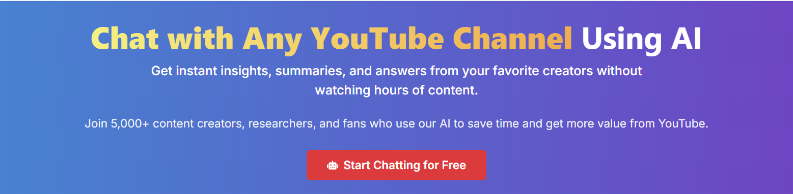

# AI Engineering & Consulting

I'm an AI engineer, sr. data scientist, and consultant specializing in production-ready machine learning systems. With extensive experience designing and implementing AI solutions for CPG and retail businesses, I help organizations build scalable, efficient, and reliable AI systems that deliver measurable ROI.

I write about life, AI - machine learning - statistics, building a business as indiehacker and of course, sports analytics. 

<!-- Structured data for SEO -->

## Independent Consulting Services

I provide expert consulting on implementing production-ready AI systems that deliver real business value:

1. **AI System Assessment & Optimization**: Evaluate your current ML infrastructure and identify improvements
2. **Production Readiness Review**: Ensure your models can handle real-world demands
3. **ML System Architecture Design**: Build scalable, maintainable AI infrastructure
4. **Custom AI Implementation**: End-to-end development of AI solutions for your specific business needs

Current and past clients include: [Diggity](https://es.linkedin.com/company/digitty), [Oxford University](https://www.cs.ox.ac.uk/research/ai_ml/index.html), and several CPG startups.

## Client Testimonials

-   > "The educational materials Franco developed for our ML program were exceptional. A complex task successfully completed."
    
    **Ajit Jaokar, Fellow, Department of Engineering Science, University of Oxford**

-   > "Franco developed the first MVP using Probabilistic Graphical Models to solve the main goal of Diggity: 'detect bottlenecks that might hinder the progress and success of the project without you having to ask for it'"
    
    **Stephan CEO, Diggity**

-   > "Working with Franco on our forecasting models gave us a competitive edge in our market."
    
    **Juan Bujacich, Manager, Nielsen**

## Ready to Transform Your Business with AI?

Don't just adopt AI - implement it strategically for real business impact.

  

  
  ✓ Personalized solutions tailored to your specific challenges  
  ✓ Implementation support from concept to production  
  ✓ Clear communication without unnecessary technical jargon  
  ✓ Focus on measurable business results, not just technical metrics  
  
  

    <!-- Custom scheduling button -->
  <a href="https://calendar.google.com/calendar/appointments/schedules/AcZssZ0JQSYOeX4y5slQlDYH66ugJq05Yx9Mj2gwfAOam5kfXNTRJZIZZUuJoHT-BsbKS-HgIM7M67ij?gv=true" class="custom-cta-button" target="_blank">Schedule Your Free 30-Minute Consultation</a>
  
  <!-- If you prefer the Google Calendar widget, uncomment this:
  <link href="https://calendar.google.com/calendar/scheduling-button-script.css" rel="stylesheet">
  
  
  -->

### YouChatChannel - Applied AI Engineering in Action

I'm the founder of [YouChatChannel](https://youchatchannel.com), an AI platform that allows you to have interactive conversations with YouTube channels through advanced AI assistants.

YouChatChannel transforms passive content consumption into an engaging, interactive experience. The platform analyzes video content through transcripts and creates specialized AI assistants (LLMs) that can answer questions, explain concepts, and provide insights based on the channel's content.

This project exemplifies how I approach AI engineering challenges: building systems that deliver real value while maintaining technical excellence behind the scenes.

### E-commerce Image Similarity Engine: From Concept to Conversion

**Business Problem:** A major e-commerce retailer struggled with product discovery across their catalog of thousands of items, limiting cross-selling opportunities.

**My Engineering Solution:** I engineered a complete visual similarity system using a proven 3-step methodology:
1. Efficient image acquisition pipeline handling thousands of product images
2. Optimized embedding generation with CLIP/ResNet models for maximum accuracy
3. High-performance similarity search using FAISS vector indexing

**Business Impact:** Inmediately customer support was able to offer similar products to customers reaching out, generating new sales or speeding up the customer support response time and reducing tedious work.  
Next application will be to compare current products with new catalogs from suppliers to identify valuable opportunities.

[Read this blogpost](/writing/posts/image-similarity-ecommerce/) to see how  this inmediate high ROI problem was solved.  
**Could your business benefit from similar AI-powered product discovery?** [Schedule a consultation](https://calendar.google.com/calendar/appointments/schedules/AcZssZ0JQSYOeX4y5slQlDYH66ugJq05Yx9Mj2gwfAOam5kfXNTRJZIZZUuJoHT-BsbKS-HgIM7M67ij?gv=true) to discuss your specific needs.

### Sportsjobs Online
I run a [job board for sports analytics](https://sportsjobs.online) and data related positions. This includes working for teams, consultancy companies, whole leagues and some esports or betting organizations.  

This is a project I handle myself, all self hosted and that I'm growing from a personal perspective. Finding sports analytics opportunities is not easy and I have a business running 24/7 which is something I encourage anyone to try.  

If you want to post a job, reach out to me at franco@sportsjobs.online or by any other channel and I'll happily charge 50% if you are coming from this site.

## Get in touch

-   :material-account-group:{ .lg .middle } __Social Media__

    ---

    You can reach out to me by email or social media.

    Email: francobetteo@gmail.com

    Stay connected and get the latest updates by following me on [:fontawesome-brands-x-twitter: Twitter](https://x.com/franbetteo), [:fontawesome-brands-bluesky: Bluesky](https://bsky.app/profile/franbetteo.bsky.social) and [:fontawesome-brands-github: GitHub](https://github.com/fbetteo). These platforms are where I share my latest content, thoughts, and projects in the world of AI and machine learning.

