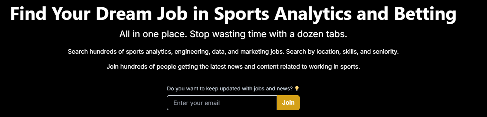

# Hey

I'm a consultant, sr. data scientist / machine learning engineer, solopreneur and AI generalist. I've vast experience in CPG and retailers including demand estimation,  price elasticity, marketing mix and assortment solutions. I have also worked in the airline industry, I've been a teacher and I have passion for sports analytics. 

I write about life, AI - machine learning - statistics, building a business as indiehacker and of course, sports analytics. 

## Independent Consulting

I run a solo consulting practice focused on helping startups build better practises relative to machine learning implementation as many software companies transition to AI. 
Also I can help preparing educational material ad hoc.

Some clients: [Diggity](https://es.linkedin.com/company/digitty), [Oxford University](https://www.cs.ox.ac.uk/research/ai_ml/index.html)  and working directly with a few CPG startups.

<!-- Ready to elevate your AI and machine learning capabilities? Schedule a free 30-minute consultation to discuss how I can help your business succeed.
[<button style="background-color: #4CAF50; border: none; color: white; padding: 15px 32px; text-align: center; text-decoration: none; display: inline-block; font-size: 16px; margin: 4px 2px; cursor: pointer; border-radius: 4px;">Schedule a Free Consultation</button>](https://calendar.app.google/jKJQhmpZ3V2WZz899){:target="_blank"} -->

<!-- Google Calendar Appointment Scheduling begin -->
<link href="https://calendar.google.com/calendar/scheduling-button-script.css" rel="stylesheet">

<!-- end Google Calendar Appointment Scheduling -->

## Sportsjobs Online
I run a [job board for sports analytics](https://sportsjobs.online) and data related positions. This includes working for teams, consultancy companies, whole leagues and some esports or betting organizations.  

This is a project I handle myself, all self hosted and that I'm growing from a personal perspective. Finding sports analytics opportunities is not easy and I have a business running 24/7 which is something I encourage anyone to try.  

If you want to post a job, reach out to me at franco@sportsjobs.online or by any other channel and I'll happily charge 50% if you are coming from this site.

## Get in touch

-   :material-account-group:{ .lg .middle } __Social Media__

    ---

    You can reach out to me by email or social media.

    Email: francobetteo@gmail.com

    Stay connected and get the latest updates by following me on [:fontawesome-brands-x-twitter: Twitter](https://x.com/franbetteo), [:fontawesome-brands-bluesky: Bluesky](https://bsky.app/profile/franbetteo.bsky.social) and [:fontawesome-brands-github: GitHub](https://github.com/fbetteo). These platforms are where I share my latest content, thoughts, and projects in the world of AI and machine learning.

