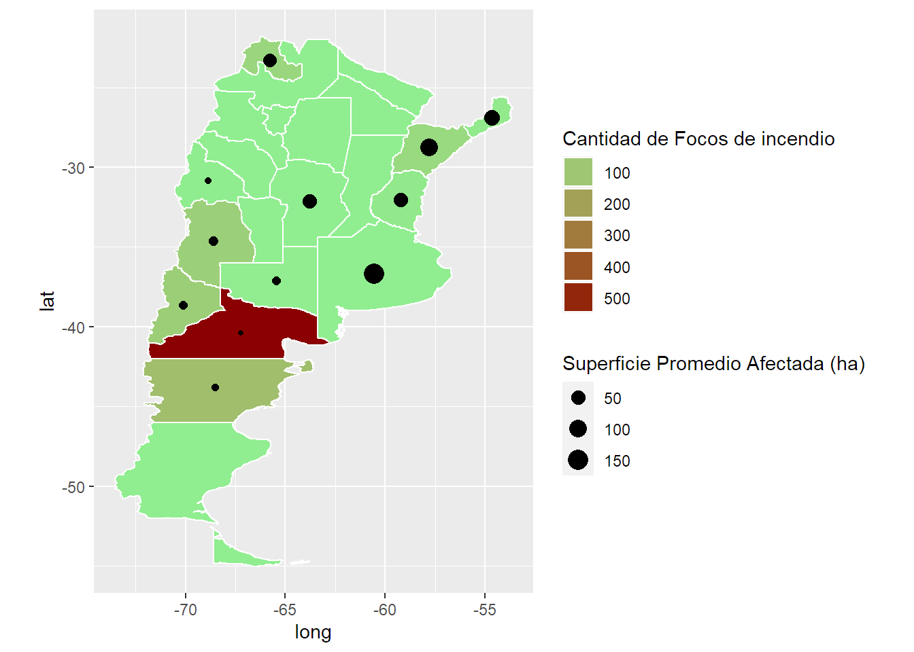

# Introduccion a graficos con mapas

## Data

Vamos a ver un ejemplo sencillo para representar información visualmente sobre mapas. En este caso un pequeño dataset de incendios forestales en Argentina de 2012 a 2015. La idea es usar ggplot y mantener el enfoque de gráficos por capas.

Vamos a necesitar.

```
> tidyverse
> rgdal
> rgeos
```
Tendremos como input las provincias, departamento, cantidad de focos por incendio, area afectada y año de inicio y fin.
Cada observación es un incendio.

Para este ejemplo nos vamos a centrar en las provincias, los focos y su efecto sin importar la fecha.

Empezamos cargando la data.


```r
library(tidyverse)
# Load Raw data
raw <- read.csv("../../static/post/2019-03-30-introduccion-a-graficos-en-mapas/focosincendio.csv", sep = ";")
raw <- as.tibble(raw)
```

```
## Warning: `as.tibble()` was deprecated in tibble 2.0.0.
## i Please use `as_tibble()` instead.
## i The signature and semantics have changed, see `?as_tibble`.
```


```r
glimpse(raw)
```

```
## Rows: 120
## Columns: 11
## $ pais_id         <int> 32, 32, 32, 32, 32, 32, 32, 32, 32, 32, 32, 32, 32, 32, 32, 32, 32, 32, 32, 32, 32, 32, 32, 32, 32, 32, 32, 32, 32, 32, 32, 32,~
## $ pais            <chr> "Argentina", "Argentina", "Argentina", "Argentina", "Argentina", "Argentina", "Argentina", "Argentina", "Argentina", "Argentina~
## $ provincia_id    <int> 6, 14, 18, 18, 18, 18, 18, 18, 18, 18, 18, 18, 18, 18, 18, 18, 18, 18, 18, 18, 18, 18, 18, 30, 30, 30, 30, 30, 30, 30, 30, 30, ~
## $ provincia       <chr> "Buenos Aires", "Córdoba", "Corrientes", "Corrientes", "Corrientes", "Corrientes", "Corrientes", "Corrientes", "Corrientes", "C~
## $ departamento_id <int> 833, 14, 56, 28, 28, 28, 70, 84, 84, 84, 112, 112, 119, 119, 126, 147, 154, 154, 161, 168, 168, 168, 168, 8, 15, 15, 15, 15, 28~
## $ departamento    <chr> "Tres Arroyos", "Calamuchita", "General Alvear", "Concepción", "Concepción", "Concepción", "Goya", "Itizaingó", "Ituzaingo", "I~
## $ sup_afectada    <dbl> 2400.00, 50.00, 257.00, 130.00, 5.00, 146.00, 30.00, 294.30, 378.00, 158.00, 300.00, 450.00, 450.00, 15.00, 20.00, 141.00, 295.~
## $ uni_med_id      <chr> "ha", "ha", "ha", "ha", "ha", "ha", "ha", "ha", "ha", "ha", "ha", "ha", "ha", "ha", "ha", "ha", "ha", "ha", "ha", "ha", "ha", "~
## $ cant_focos      <int> 1, 1, 1, 2, 1, 1, 1, 3, 1, 3, 1, 1, 5, 2, 2, 1, 3, 1, 1, 18, 2, 3, 2, 1, 0, 0, 1, 7, 0, 2, 1, 0, 0, 0, 5, 10, 10, 3, 1, 1, 1, 1~
## $ año_inicial     <int> 2014, 2015, 2012, 2012, 2013, 2015, 2012, 2012, 2013, 2014, 2012, 2013, 2012, 2013, 2015, 2012, 2012, 2014, 2012, 2012, 2013, 2~
## $ año_final       <int> 2014, 2015, 2012, 2012, 2013, 2015, 2012, 2012, 2013, 2014, 2012, 2013, 2012, 2013, 2015, 2012, 2012, 2014, 2012, 2012, 2013, 2~
```


Exploramos un poco el dataset. Lo que nos vas a interesar represetnar es la segunda parte del código. Variables agregadas a nivel provincia.


```r
# Generate Summary to Explore
sum_year <- raw %>% group_by(año_inicial) %>%
  summarise(focos = sum(cant_focos), sup = sum(sup_afectada, na.rm = TRUE)) %>%
  mutate(sup_prom = sup/focos)

# Actual data to be plotted
sum_prov <- raw %>% group_by(provincia) %>%
  summarise(focos = sum(cant_focos), sup = sum(sup_afectada, na.rm = TRUE)) %>%
  mutate(sup_prom = sup/focos) %>%
  arrange(desc(sup_prom)) %>%
  mutate(provincia = as.character(provincia))

head(sum_prov)
```

```
## # A tibble: 6 x 4
##   provincia    focos   sup sup_prom
##   <chr>        <int> <dbl>    <dbl>
## 1 Buenos Aires     1 2400    2400  
## 2 Corrientes      55 5440.     98.9
## 3 Misiones        10  679      67.9
## 4 Córdoba          1   50      50  
## 5 Entre Ríos      12  594      49.5
## 6 Jujuy           62 2721.     43.9
```

Tenemos por provincia la cantidad de focos y la superficie  afectada. Vamos a usar la superficie promedio por foco para visualizar la magnitud de cada foco de incendio.

Ahora llega lo importante. ¿Cómo representar esta data provincial en un mapa de Argentina?

# Mapa

Necesitamos un **ShapeFile** de Argentina, que basicamente es el tipo de archivo que se usa para representar mapas en gráficos. Contiene divisiones del país (provincias) con sus respectivas coordenadas y nombres.

Utilizaremos data descargada del siguiente link.
url <- "http://biogeo.ucdavis.edu/data/diva/adm/ARG_adm.zip"

Lo descargué y deszipee en la computadora. Lo leemos con una librería particular *RGDAL*.

dsn contiene la ruta a la carpeta con los archivos del shapefile.
Layer apunta a al set de archivos que contiene la data que queremos. Generalmente hay otros sets con información no relevante al gráfico.


```r
argentina <- rgdal::readOGR(dsn = "../../static/post/2019-03-30-introduccion-a-graficos-en-mapas/ARG_adm", layer = "ARG_adm1", use_iconv=TRUE, encoding='UTF-8')
```

```
## OGR data source with driver: ESRI Shapefile 
## Source: "D:\DataScience\StatsBlog\blogStats\static\post\2019-03-30-introduccion-a-graficos-en-mapas\ARG_adm", layer: "ARG_adm1"
## with 24 features
## It has 9 fields
## Integer64 fields read as strings:  ID_0 ID_1
```

Es un archivo S4 por lo que se utiliza "@" para acceder a su contenido. Por ejemplo:


```r
head(argentina@data)
```

```
##   ID_0 ISO    NAME_0 ID_1                 NAME_1           TYPE_1        ENGTYPE_1 NL_NAME_1
## 0   12 ARG Argentina    1           Buenos Aires        Provincia         Province      <NA>
## 1   12 ARG Argentina    2                Córdoba        Provincia         Province      <NA>
## 2   12 ARG Argentina    3              Catamarca        Provincia         Province      <NA>
## 3   12 ARG Argentina    4                  Chaco        Provincia         Province      <NA>
## 4   12 ARG Argentina    5                 Chubut        Provincia         Province      <NA>
## 5   12 ARG Argentina    6 Ciudad de Buenos Aires Distrito Federal Federal District      <NA>
##                                                                               VARNAME_1
## 0                                                                   Baires|Buenos Ayres
## 1                                                                               Cordova
## 2                                                                                  <NA>
## 3                                                        El Chaco|Presidente Juan Peron
## 4                                                                                  <NA>
## 5 BUENOS AIRES D.F.|Capital Federal|Distretto Federale|Distrito Federal|Federal Capital
```

Este tipo de archivos tiene una estructura complicada y hay varias librerías útiles. Con el fin de mantenernos dentro del tidyverse usaremos el enfoque de ggplot por capaz para graficar.
Primero necesitamos llevar la información del shapefile a un dataframe.


```r
# Transformo a dataframe.
argentina_df <- broom::tidy(argentina)
```

```
## Regions defined for each Polygons
```

```r
# id es la provincia
head(argentina_df)
```

```
## # A tibble: 6 x 7
##    long   lat order hole  piece group id   
##   <dbl> <dbl> <int> <lgl> <fct> <fct> <chr>
## 1 -60.2 -33.3     1 FALSE 1     0.1   0    
## 2 -60.2 -33.3     2 FALSE 1     0.1   0    
## 3 -60.2 -33.3     3 FALSE 1     0.1   0    
## 4 -60.2 -33.3     4 FALSE 1     0.1   0    
## 5 -60.2 -33.3     5 FALSE 1     0.1   0    
## 6 -60.2 -33.3     6 FALSE 1     0.1   0
```

Ahora genero un diccionario de ids con su respectiva provincia para poder linkear mi mapa con la data de incendios.


```r
ids <- cbind.data.frame(provincia = as.character(argentina@data$NAME_1), id = as.character(rownames(argentina@data))) %>%
  mutate(provincia = as.character(provincia), id = as.character(id))
```

El dataframe generado a partir del shapefile tiene las coordenadas que forman cada provincia y el id. Ahora lo que haremos es pegarle la data de incendios para poder utilizarla sobre el mapa.
Está generado el log de los focos porque en una prueba intenté usar la data transformada para suavizar outliers pero no se verá en esta versión.


```r
# Agrego provincia por ID y data de incendios a la data del shapefile.
argentina_df2 <- argentina_df %>% left_join(ids, by = "id") %>%
  left_join(sum_prov, by = "provincia") %>%
  mutate(focos = ifelse(is.na(focos),0.5,focos),
         logfocos = log(focos), 
         logfocos2 = logfocos - min(logfocos))
```

Por ahora vamos a poder ser capaces de graficar un mapa de argentina con sus provincias delimitadas y pintarlas según la cantidad de focos de incendio por ejemplo. Pero además vamos a querer agregar alguna forma sobre cada provincia. Por ejemplo un punto de distinto tamaño según el area afectada por cada foco en promedio. Para eso necesitamos localizar el centroide de cada poligono, es decir, el centro de cada provincia.
Para ellos usamos la librería **RGEOS**
Luego a cada centro le agrego la data que voy a querer usar. En este caso la superficie promedio afectada por foco de cada provincia.


```r
# Calculo el centro de cada poligono (provincias)
# para obtener el "centro" donde iran los puntos o nombres.
centros <- rgeos::gCentroid(argentina, byid = TRUE) %>%
  as.data.frame() %>%
  mutate(id = rownames(.))

# Agrego data relevante para el ploteo (superficie promedio)
centros2 <- centros %>% left_join(ids, by = "id") %>%
  left_join(sum_prov, by = "provincia") %>%
  mutate(focos = ifelse(is.na(focos),0.5,focos),
         sup = ifelse(is.na(sup),0,sup),
         log_sup_prom = log(sup_prom),
         sup_prom_sin_outlier = ifelse(sup_prom > 150, 150,sup_prom) ) # esto es para suavizar el outlier. Buscar otro enfoque.
```

## Grafico!

Ya tenemos todo. Tenemos el mapa, tenemos la cantidad de focos de incendio por provincia y tenemos el centro de cada provincia donde vamos a incluir un punto que muestra la intensidad de los incendios.
Simplemente graficamos sigueindo la lógica por capas de ggplot.
Las provincias sin puntos son aquellas que no tuvieron ningún incendio.


```r
ggplot() +
  geom_polygon(data = argentina_df2, aes(x=long, y = lat, group = group,  fill = focos), color = "white") + # mapa de argentina
  # coloreado segun cantidad de focos
  coord_fixed(0.8) + # tamañp del mapa
  scale_fill_gradient2("Cantidad de Focos de incendio", low = "white", mid = "lightgreen", high = "darkred") + # escala de colores para focos
  geom_point(data = centros2, aes(x = x, y = y, size = sup_prom_sin_outlier)) + # puntos por provincia con superficie promedio
  scale_size(name = "Superficie Promedio Afectada (ha)",range = c(1,5)) + # escala de los puntos
  guides(fill = guide_legend(order = 1), # Orden de los leyendas a la derecha.
         size = guide_legend(order = 2)) # Por algun motivo esto discretizo la leyenda de focos
```




