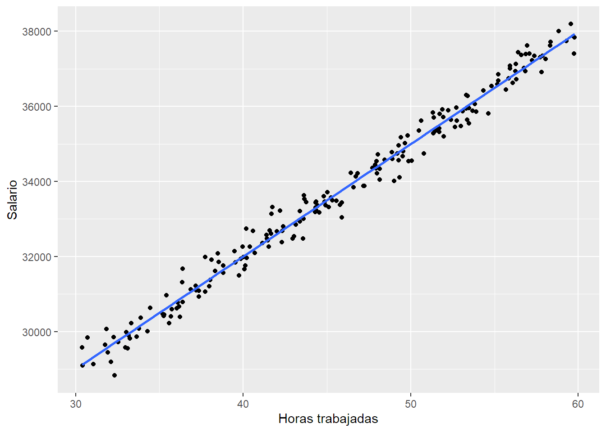
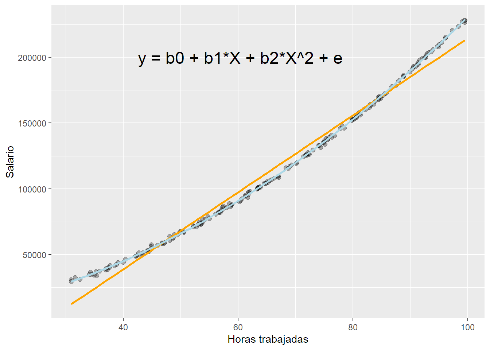
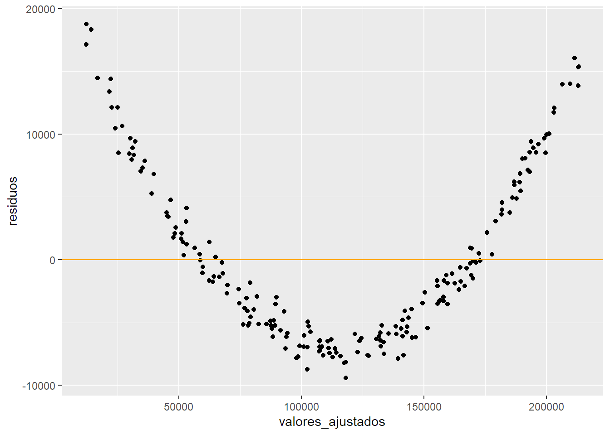
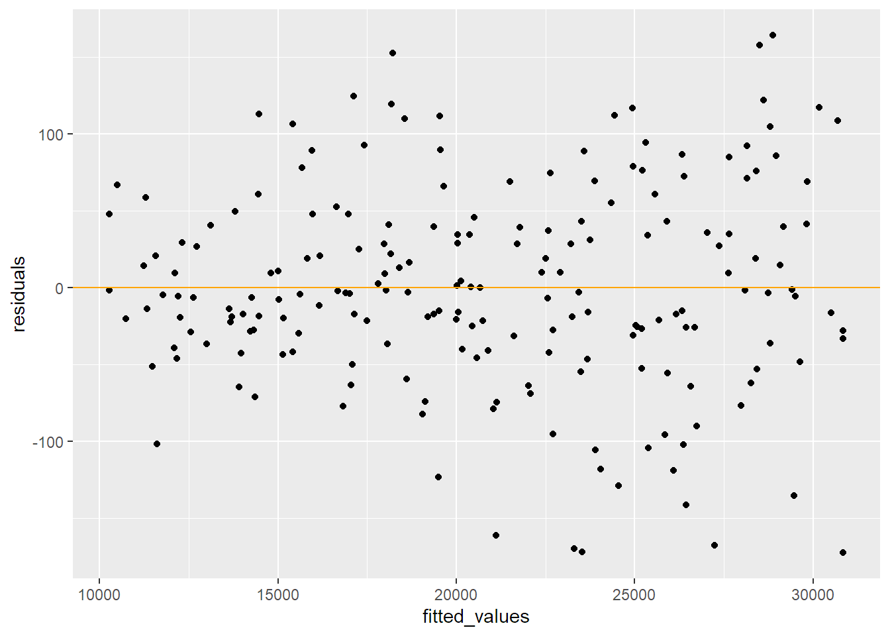

# Regresion Lineal - ISLR Capítulo 3

La regresión lineal simple es un método muy directo para estimar una variable cuantitativa Y en base a un solo predictor X. Asume que hay una relación lineal entre X e Y.
$$ Y \approx \beta_0 + \beta_1X$$
$\beta_0$ y $\beta_1$ son dos constantes desconocidas que representan al _intercepto_ y a la _pendiente_ del modelo lineal. Son los coeficientes o parámetros. Con nuestros datos podemos estimar coeficientes para predecir futuros valores de Y basados en X y nuestro modelo.

### Estimación de Coeficientes

Los coeficientes que buscamos son $\hat \beta_0$ y $\hat \beta_1$ (estimados, por eso el sombrero) son aquellos que generen una recta que pase lo más cerca posible de todos nuestros datos de entrenamiento. Hay varias manera de definir "cerca" pero la más usada es el enfoque de _mínimos cuadrados_.

Supongamos un ejemplo donde tenemos datos de horas trabajadas por ciertos individuos y la paga que reciben. Supongamos a fines del ejemplo que la relación entre salario y horas es lineal (sabemos que no es real...)

Cuando estimemos $\hat \beta_0$ y $\hat \beta_1$ obtendremos después un valor $\hat y_i$ para cada valor de $x_i$ (cada observación), que será el resultado de la predicción de nuestro modelo para ese valor de horas trabajadas.
$$ \hat y_i = \hat \beta_0 + \hat \beta_1 x_i$$
Luego $e_i = y_i - \hat y_i$ representa el _residuo_, que es la diferencia entre el valor real del salario para esa observación y el valor que predice nuestro modelo.  
Una métrica importante a saber es la _suma de resiudos al cuadrado_ (RSS por siglas en inglés) que es:
$$ RSS = e_1^2 + e_2^2 + ... + e_n^2$$
o de manera equivalente:
$$ RSS = (y_1 - \hat \beta_0 - \hat \beta_1x_1) ^2 +  (y_2 - \hat \beta_0 - \hat \beta_1x_2) ^2  + ... + (y_n - \hat \beta_0 - \hat \beta_1x_n) ^2 $$

Que basicamente es la suma de todas las diferencias entre lo predicho por nuestro modelo y el dato real de nuestro set, elevadas al cuadrado. Esto último es principalmente para evitar que se compensen los errores. Sobreestimar por 10 y luego subestimar por 10 tiene como suma de errores 0. Si elevamos esas diferencias al cuadrado, todos los errores serán positivos y se acumularán. En este caso seria $10^2$ + $(-10)^2$, que es 200.  
El enfoque de mínimos cuadrados estima $\hat \beta_0$ y $\hat \beta_1$ de tal manera que el RSS sea el mínimo posible dados los datos.  

Usando un poco de cálculo se puede demostrar que los parámetros que minimizan RSS son:
$$ \hat \beta_1 = \frac{\sum_{i = 1}^n (x_i - \bar{x}) (y_i - \bar{y})}{\sum_{i=1}^n (x_i - \bar{x})^2}$$
$$ \hat \beta_0 = \bar{y} - \hat \beta_1\bar{x}$$
donde $\bar{y}$ y $\bar{x}$ son las respectivas medias muestrales.

En nuesto caso usando este set de datos generado ficticiamente obtenemos $\hat \beta_0$ = 2.000713 &times; 104  
y $\hat \beta_1$ = 299.82

Recordemos que esta es una estimación en base a los datos y no sabemos los verdaderos parámetros de la DGP real(proceso generador de datos). En este caso yo si lo sé porque generé los datos pero en la vida real es inaccesible.  
Lo que hicimos fue estimar, a partir de un set de datos, ciertos coeficientes o característica de una población mucho más amplia. (Todos los trabajadores del país..)

### Precisión de nuestros estimadores

En este caso teníamos una sola muestra pero podríamos haber tenido muchas muestras (K) de la misma población (muchos sets de datos con horas trabajadas y salarios).  
Si estimáramos los coeficientes para cada uno de esos sets obtendríamos K pares de coeficientes, cada uno calculado con las particularidades de esos sets.  
Se puede demostrar que el promedio de una cantidad grande de estimadores provenientes de muchas muestras se centra en el verdadero valor poblacional (si el modelo es correcto). Es decir que el promedio de los K $\hat \beta_1$ va a centrarse en el verdadero valor poblacional de $\beta_1$ ( y lo mismo para $\beta_0$).  
Pero estos K parámetros centrados en el verdadero valor van a tener cierta dispoersión, es decir, pueden estar todos muy cerca del verdadero o estar muy dispersos pero que en promedio si quede centrado. Esto determina que tan preciso es el coeficiente que estimemos de una muestra.  Este desvío estándar de los parámetros (SE) puede estimarse y depende de la varianza del error del modelo.

Puede ser útil para calcular los _intervalos de confianza_ de los parámetros. Estos son intervalos que con X% de probabilidad contienen al verdadero valor del parámetro poblacional. Lo más habitual es calcular el intervalo de confianza al 95%.
Para $\hat \beta_1$ esto es aproximadamente:
$$ \hat \beta_1 \pm 2 \cdot SE(\hat \beta_1)$$
La interpretación sería que de 100 intervalos que construya de esta manera (de 100 muestras distintas), 95 van a tener al verdadero valor de $\beta_1$.  

Por otra parte podemos realizar un test de hipotésis de los coeficientes. El más común es testear la siguiente hipótesis nula:  
*H_0* : No hay relación entre X e Y  
contra la hipótesis alternativa  
*H_1* : Hay alguna relación entre X e Y  
Lo cual se traduce en:
$$ H_0 : \beta_1 = 0 $$
$$ H_1 : \beta_1 \neq 0$$

Lo que se hace es determinar si $\hat \beta_1$ está lo suficientemente lejos de 0 como para rechazar la hipótesis nula. Qué tan lejos es suficiente depende en gran parte del desvío estándar (SE) del coeficiente. Si el SE es grande , necesitaremos valores elevado de $\hat \beta_1$ para estar tranquilos con que el valor real no puede ser 0.  
Para esto lo que se hace es calcular el estadístico _t_:
$$ t = \frac{\hat \beta_1 - 0}{SE(\hat \beta_1)}$$
Que mide cuantos desvíos estándar $\hat \beta_1$ está alejado de 0. Si no hay relación entre X e Y se espera que el estadístico tenga una distribución t con n - 2 grados de libertad. Dado ese supuesto, lo que se hace es calcular la probabilidad de obtener un valor de t como el de nuestro estadístico, si este proviene de una distribución t con n-2 grados de libertad. Esta probabilidad se la conoce como  _p valor_.
Sería qué tan probable es encontrar un valor al menos tan grande como el de t si este proviniera de la distribución t con n-2 grados de libertad. Si esta probabilidad es muy chica (el umbral habitual es 0.05 pero depende del trabajo) uno rechaza la hipótesis nula en favor de la alternativa, suponiendo que sí hay una relación entre X e Y.

### Precisión del modelo.

Naturalmente a uno le interesa saber qué tan bien ajusta nuestro modelo a los datos.

El método más habitual para regresión lineal es el R^2. Toma valores entre 0 y 1 porque es la proporción de la varianza de Y explicada por nuestro modelo.

$$ R^2 = \frac{TSS - RSS}{TSS} = 1 - \frac{RSS}{TSS}$$

donde $TSS = \sum (y_i -\bar{y})^2 $ es la suma de cuadrados totales y RSS es la suma de errores cuadrados que ya definimos antes. TSS mide la varianza total de Y y representa la variabilidad total inherent de la variable dependiente _antes_ de correr la regresión. Por el contrario RSS mide la variabilidad que queda sin explicar por nuestro modelo (recuerden que proviene de los residuos).  Por lo tanto el numerador TSS - RSS mide la parte de la variabilidad de Y que sí pudo ser explicada por el modelo, y lo divide por la variabilidad total. $R^2$ mide entonces la proporción de la variablidad que pudo ser explicada usando X. Cuanto más cerca de 1, mejor.

### Regresión con Múltiples Predictores

Suena mucho más lógico tratar de explicar una variable dependiente no solo por una independiente si no por varias. La regresión lineal simple puede ampliarse a regresión lineal múltiple donde nuestro modelo pasa a ser:
$$ \hat y_i = \hat \beta_0 + \hat \beta_1 x_i + ... + \hat \beta_p x_p$$
Y mantenemos un término de error con distribución normal y media 0.

En esencia la idea es la misma, explicar la variabilidad de Y basado en la variabilidad de nuestros predictores. La metodología para estimar los coeficientes suele ser Mínimos Cuadrados como vimos antes, sin embargo la solución no suele ser tan fácil de expresar y es más sencillo verlo en términos matriciales o simplemente ver los resultados desde el programa estadístico que estemos usando.
No olvidar que varias regresiones simples no pueden sumarse en una resgresión múltiple, es decir, los coeficientes de las regresiones simples no tienen por que ser los mismos ni por qué mantener el signo cuando se juntan todas las variables en un solo modelo. Esto sucede porque la regresión múltiple estima coeficientes _controlando_ por todas las otras variables, es decir, quitando el efecto de las otras. Por eso es que por separado quizás dos variables son significativas pero en una regresión múltiple solo una de ellas lo es. En general esto viene dado porque están correlacionadas y se comportan de manera similar. Al final del día no es fácilmente distinguible cuál es realmente la que lidera el efecto.

#### Hay relación entre la dependiente y los predictores? (test F)

En regresión simple vimos el test de hipótesis para ver si el coeficiente de $\hat \beta_1$ era significativamente distinto de 0. En regresión múltiple lo que debemos hacer es chequear si _todos_ nuestros coeficientes son distintos de 0. (Y no uno por uno)

Lo cual se traduce en:
$$ H_0 : \beta_1 = \beta_2 = ... = \beta_p = 0 $$
$$ H_1 : \text{Al menos algún } \beta_j \neq 0$$
El test de hipótesis se hace calculando el estadístico F.
$$ F = \frac{(TSS - RSS) / p}{RSS / (n - p -1)}$$

Si los supuestos del modelo lineal se cumplen puede probarse que $E[RSS/(n - p-1)] = \sigma^2$ y si $H_0$ es verdadera $E[(TSS-RSS)/p] = \sigma^2$. Por lo tanto si no hay relación el estadístico F será cercano a 1 y si en realidad la hipótesis alternativa es verdadera el numerador será mayor que $\sigma^2$ y por lo tanto F será mayor que 1. Dependiendo de n, p y del nivel de significatividad que busquemos F deberá superar un umbral distinto para poder rechazar la hipótesis nula.  
Es inevitable mirar los p-valores individuales sin embargo debemos tener cuidado particularmente cuando tenemos muchas variables. Por definición, algunos coeficientes saldrán significativos _por azar_ aunque no tengan relación con la variable dependiente. En el caso típico de significativdad del 95%, esto sucede en promedio el 5% de las veces. Con muchas variables nuestras posibilidades de encontrarnos con al menos algún falso significativo aumentan notoriamente por lo que hay que mirar con cuidado. Por su parte, el estadístico F corrige en su cálculo por la cantidad de coeficientes y por lo tanto no se ve afectado por este problema.

#### Selección de variables

Cuando tenemos un set de datos grande es habitual tener que seleccionar cuáles son las variables importantes para el modelo. Más allá del conocimiento del problema (fundamental), idealmente lo mejor es probar una gran cantidad de modelos y con alguna métrica de comparación seleccionar los mejores. El problema es que la cantidad de modelos posible crece exponencialmente con la cantidad de variables y esto no es posible.  
En el libro los autores mencionan como alternativas Forward Selection, Backward Selection y Selección mixta. Básicamente son enfoques que prueban una muestra de todos los modelos posibles según la significatividad de las variables. Son métodos iterativos. Habiendo avanzado la disciplina, llegado el caso buscaría otros métodos vigentes para atacar este problema.

#### Ajsute del modelo

Para verificar el ajuste del modelo se sigue usando el $R^2$ como métrica principal. En este caso es equivalente a la correlación al cuadrado de Y e $\hat Y$. Un punto a tener en cuenta es que el R^2 nunca puede disminuir al agregar variables ya que el peor escenario posible es que la nueva variable tenga coeficiente de 0 y el ajuste quede igual que antes. Lo que se hace para controlar por esto y poder comparar modelos es ajustar el $R^2$ por la cantidad de variables utilizadas o usar el RSE. De cualquier manera lo importante es recordar que el R2 sigue siendo útil en la regresión lineal múltiple.

### Otras consideraciones

* Las variables independientes admiten variables categóricas! (Binarias o multiclase). Ej: Educación máxima alcanzada.
Hay que mirar con atención la interpretación. Alteran el intercepto según la categoría de la observación y puede alterar pendientes si se las incluye en interacción con alguna variable continua.

* El modelo que venimos viendo el aditivo y lineal, pero podemos remover esos supuestos. Por ejemplo podemos agregar interacción entre variable y por lo tanto relajar la aditividad. Esto significa que las variables se modelan multiplicadas entre sí por ejemplo.

$$ Y = \beta_0 + \beta_1X_1 + \beta_2X_2 +  \beta_3X_1X_2 + \epsilon $$

* Podemos aproximar relaciones no lineales extendiendo el modelo a regresión polinómica.
Suponiendo que los datos provienen de un modelo polinómico, podemos ver en el siguiente gráfico cómo cambia al agregar el término de no linealidad.
La línea naranja es la regresión lineal simple y la celeste (que ajusta casi perfecto) es la regresión polinómica que respeta el proceso generador de los datos (la ecuación que se ve en el gráfico). Vemos que la variable Y depende de X linealmente pero también de X al cuadrado, lo que le da la curvatura.

### Potenciales problemas

#### No linealidad de los datos

Si la relación entre nuestras variables independientes y la dependiente no es lineal nuestro modelo va a tener sesgo alto. Para el modelo simple es fácil de ver al graficar X vs Y en un gráfico de puntos pero con muchas variables eso ya no es tan sencillo. Un buen enfoque es realizar una regresión lineal y graficar los residuos contra los valores predichos.

Es un caso un poco extremo pero supongamos que la relación es no lineal, polinómica  de orden 2 (como el ejemplo de arriba).  
Si nosotros corremos una regresión lineal, nuestros residuos van a seguir un patrón muy obvio.

Claramente en ese gráfico el residuo no está centrado en 0...
En cambio, si nosotros corremos una regresión lineal para un modelo realmente lineal, o para este caso, corremos un modelo no lineal, deberíamos ver una nube de puntos dispersa para los resiudos, centrada en 0 y con algún desvío estándar.
Idealmente veríamos algo asi.

#### Correlación de los términos de error

Uno de los supuestos de la regresión lineal es que los errores no están correlacionados, es decir que el error $\epsilon_i$ de una observación no nos aporta información acerca del error $\epsilon_j$ de otra observación. Son independientes.  
Si esto no se cumple lo que sucede es que el SE de los coeficientes estimados es menor al real y puede llevarnos a confiar más en nuestro modelo de lo que deberíamos.  
Los errores correlacionados suelen suceder más frecuentemente en series de tiempo pero también pueden darse  en estudios experimentales mal diseñados.

#### Varianza de los términos de error no constante. (Heterocedasticidad)

Otro supuesto de la regresión lineal es que la varianza de los errores es constante $Var(\epsilon_i) = \sigma^2$. Esto no siempre es el caso.
En este ejemplo vemos como los resiudos siguen centrados en 0 pero con una dispersión mucho mayor a medida que avanzamos en el eje X.

Entre las soluciones para este problema se encuentra transformar la variable dependiente - $ln(y)$ por ejemplo, o utilizar Mínimos cuadrados ponderados, que pondera por la inversa de la varianza. El libro no se explaya mucho más al respecto en este capítulo.

#### Outliers

Los outliers son observaciones cuya variable dependiente tienen valores que se alejan mucho del patrón regular de los datos, por ejemplo debido a un error de medición o problema al registrar la información. Los outliers pueden tener diversas consecuencias en los modelos lineales. Puede afectar la estimación de los parámetros, puede afectar el ajuste del modelo (caída del $R^2$) o puede por ejemplo aumentar los intervalos de confianza ya que el outlier afecta el RSE que es común a todos los intervalos. Todo esto puede ser generado por una sola observación. Generalmente si no se distinguen en el análisis exploratorio pueden saltar a la vista analizando los resiudos del modelo (o los residuos estandarizados).

#### Puntos con alto "leverage"

- Si alguno tiene una traducción satisfactoria bienvenido sea..
Los puntos con alto leverage son aquellos cuyo valor de la variable independiente se aleja del rango estándar. Las observaciones con esta característica tienden a afectar en buena medida a la curva ajustada y por ende a los parámetros de nuestro modelo. Nuestra estimación por mínimos cuadrados puede verse muy influenciada por estos puntos e invalidar el ajuste por eso es muy necesario identificar estas observaciones.  
En regresión simple es sencillo de ver porque resaltan si graficamos una nube de puntos pero en regresión múltiple es más difícil de ver ya que debemos encontrar anomalías en el conjunto de todas las variables. Es decir que una observación puede estar en el rango individual de cada variable pero si miramos a nivel conjunto, esa combinacion dentro de los rangos individuales es súper anómala. Con más de dos variables independientes se dificulta identificar visualmente. Para ayudar en estos casos se puede calcular el _estádistico de leverage_ en algún programa estadístico.

#### Colinealidad

Este problema refiere a la alta correlación entre variables independientes del modelo, es decir que tienden a aumentar o decrecer de manera conjunta. Esto genera que sea difícil (o imposible en el extremo) diferenciar el impacto de cada una de ellas en la variable dependiente.  
En una regresión lineal esto se traduce en aumento de la varianza de los estimadores y por ende incertidumbre sobre los parámetros estimados. A modo intuitivo, con variables con alta correlación puede haber una gran cantidad de combinaciones de coeficientes para estas variables que resulten en un mismo ajuste ($R^2$) y por ende mínimos cuadrados es _indistinto_ frente a ellos. Cambiando alguna observación puede que el modelo pase de una combinación a otra muy disinta en ese arco de posibilidades. Otra consecuencia es que el aumento de la varianza de los coeficientes reduce el estadístico t que miramos para la significatividad y puede que lleve a no rechazar una hipótesis nula que debía ser rechazada. La potencia del test de hipótesis se ve disminuida por la colinealidad.  
No solo la correlación sirve para detectar colinealidad. Puede existir multicolinealidad en donde varias variables son colineales aún sin tener alta correlación de a pares. Posiblemente se deba a combinación lineal generada por algunas de las variables. Para estos casos lo que se puede mirar es el VIF ( Variance Inflation Factor) en inglés. Este estadístico se calcula para cara variable y compara la varianza del estimador al tener la variable en el modelo versus ajustando un modelo solo con esa variable. Cuanto mayor es el VIF, mayores problemas de colinealidad resalta.
Se puede calcular con la siguiente formula donde $R^2_{X_j|X_{-j}}$ es el $R^2$ de la regresión de $X_j$ contra todas las otras variables independientes del modelo.
$$ VIF(\hat \beta_j) = \frac{1}{1 - R^2_{X_j|X_{-j}}}$$
La solución a este problema suele ser descartar alguna de las variables o agruparlas de alguna manera para quedarnos con una única variable que represente a ambas.
