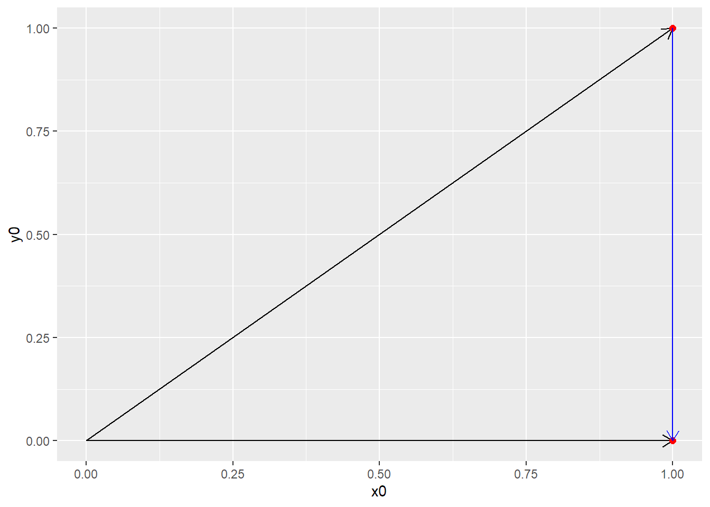
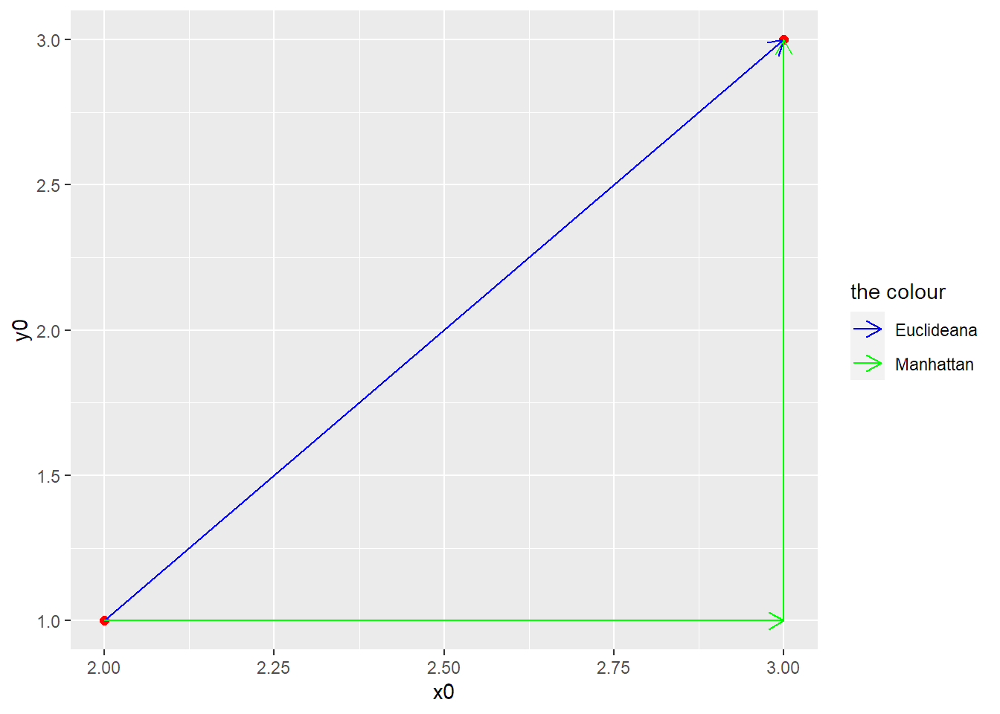
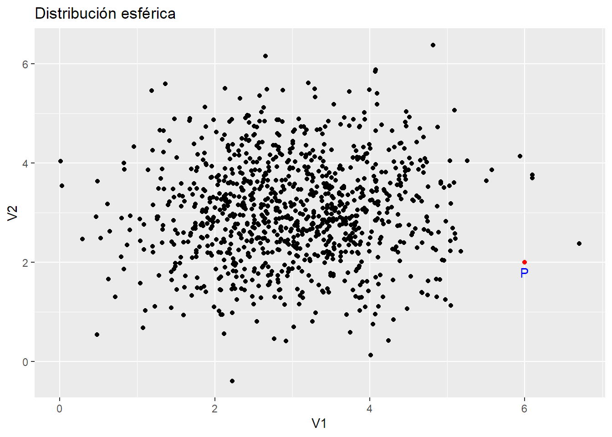
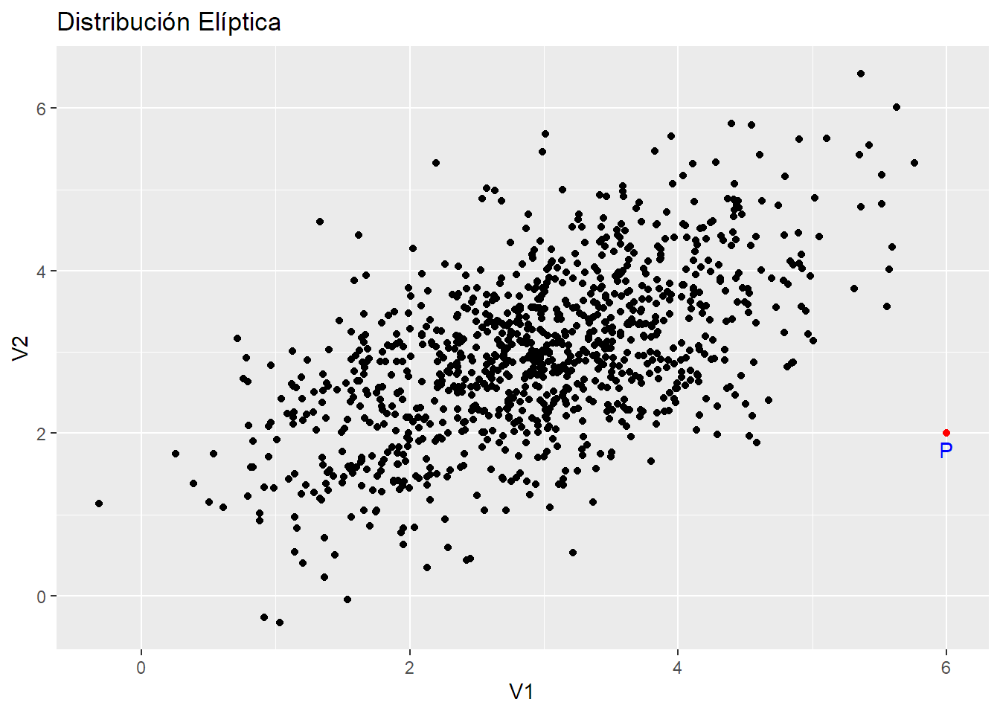

# Distintas Distancias

```r
library(tidyverse)
```


Si tenemos un espacio euclideo, es decir, una linea, un plano o un hiperplano, que son los espacios
típicos de la geometría clásica, podemos calcular la distancia entre dos puntos que se hayen en él.

Es decir, cuál es la distancia entre los puntos A (1,1) y B (1,0) en un plano?
Empecemos pensando en los casos donde todos los valores del vector son numéricos.


```r
A = c(0,0,1,1)
B = c(0,0,1,0)
recta = c(1,1,1,0)
df = as.data.frame(matrix(data = c(A,B, recta),
                          nrow = 4, 
                          ncol = 4,
                          byrow = TRUE )) %>%
  rename( x0 = V1,
          y0 = V2,
          x1 = V3,
          y1 = V4)


ggplot(data=df[1:2,], aes(x=x0, y=y0)) + 
  geom_segment(aes(xend=x1, yend=y1),
               arrow = arrow(length = unit(0.3,"cm"))) + 
  geom_point( aes(x = x1, y = y1), 
              color = "red", size = 2)
```


### Distancia Euclideana

La métrica más habitual que se utiliza es la distancia euclideana, que consiste en la recta que une ambos puntos. 

```r
ggplot(data=df[1:2,], aes(x=x0, y=y0))+
  geom_segment(aes(xend=x1, yend=y1),
               arrow = arrow(length = unit(0.3,"cm"))) + 
  geom_point(aes(x = x1, y = y1), 
               color = "red", size = 2) + 
  geom_segment(data = df[3,], 
               aes(xend=x1, yend=y1),
               color = "blue", 
               arrow = arrow(length = unit(0.3,"cm")))
```



Esta distancia se calcula con:  
$$d(A,B) = d(B,A) = \sqrt{(A_1 - B_1)^2 + (A_2 - B_2)^2 + ... + (A_n - B_n)^2}  
= \sqrt{\sum_{i=1}^n (A_i - B_i)^2}$$

Como se ve en la imagen, los puntos A y B pueden verse como vectores que inician en el origen (0,0). La distancia euclidea es a su vez la distancia entre sus puntas, que a su vez puede pensarse como un vector de desplazamiento (de A a B por ejemplo).

En este caso la distancia euclidea es:
$$d(A,B) = \sqrt{ (1-1)^2 + (1 - 0)^2} = 1$$
Y que es algo visible en el gráfico.

De manera más general, podemos definir toda una familia de distancias en el espacio euclideo.
*Las distancias de Minkowsky.*

La distancia Minkowsky de orden p es:
$$d(A,B) = d(B,A) = \Bigg({\sum_{i=1}^n |A_i - B_i|^p}\Bigg)^{1/p}$$

Vemos que si p = 2, entonces la distancia de Minkowsky no es otra que la distancia euclideana.

### Distancia de Manhattan

Otro valor que suele tomarse para p es p = 1, y eso corresponde a la *distancia de Manhattan*.


Esta distancia se calcula con:  
$$d(A,B) = d(B,A) =  |A_1 - B_1| + |A_2 - B_2| + ... + |A_n - B_n|  
=\sum_{i=1}^n |A_i - B_i|$$

Es básicamente la suma de las diferencias absolutas entre las distintas dimensiones de los vectores.

Luce asi.


```r
A = c(0,0,3,3)
B = c(0,0,2,1)
recta = c(2,1,3,3)
manhattan1 = c(2,1,3,1)
manhattan2 = c(3,1,3,3)

df = as.data.frame(matrix(data = c(A,B, recta, manhattan1, manhattan2),
                          nrow = 5, 
                          ncol = 4,
                          byrow = TRUE )) %>%
  rename( x0 = V1,
          y0 = V2,
          x1 = V3,
          y1 = V4)


ggplot(data=df[1:2,], aes(x=x0, y=y0)) + 
    geom_point( aes(x = x1, y = y1), 
              color = "red", size = 2) + 
      geom_segment(data = df[3,], 
               aes(xend=x1, yend=y1, color = "blue"),
               #color = "blue", 
               arrow = arrow(length = unit(0.3,"cm"))) +
      geom_segment(data = df[4,], 
               aes(xend=x1, yend=y1,  color = "green",),
               #color = "green", 
               arrow = arrow(length = unit(0.3,"cm"))) + 
      geom_segment(data = df[5,], 
               aes(xend=x1, yend=y1),
               color = "green", 
               arrow = arrow(length = unit(0.3,"cm"))) +
      scale_colour_manual(name = 'the colour', 
         values =c('blue'='blue','green'='green'),
         labels = c('Euclideana','Manhattan'))
```



Vemos como el valor abosluto imposibilita ir en dirección diagonal. Lo que se logra es medir la distancia como si hubiera una grilla como la del gráfico. Su nombre proviene de su utilización para medir distancias al interior de una ciudad (uno no puede cruzar las manzanas por el medio!).

Para saber cual conviene utilizar hay que pensar en el problema en cuestión. 

* Ya sea medir distancias en ciudades o donde haya restricciones de ese tipo puede que Manhattan sea más apropiado.  
* Por otra parte al no elevar al cuadrado le da menos pesos a las grandes distancias o mismo outliers por lo que puede ser otro motivo válido.  
* Por último, algunos trabajos argumentan que es más adecuada en problema de alta dimensionalidad (o mismo valores menores a 1 en el exponente de la formula de Minkowsky)


### Similaridad coseno


La similaridad coseno se utiliza cuando se quiere ver la similitud "angular" entre dos observaciones y no la distancia en el plano. Es decir, vemos la dirección pero no la magnitud


```r
A = c(0,0,1,1)
B = c(0,0,2,2)
C = c(0,0,5,0)

df = as.data.frame(matrix(data = c(A,B,C),
                          nrow = 3, 
                          ncol = 4,
                          byrow = TRUE )) %>%
  rename( x0 = V1,
          y0 = V2,
          x1 = V3,
          y1 = V4)


ggplot(data=df[1:3,], aes(x=x0, y=y0 )) + 
  geom_segment(aes(xend=x1, yend=y1),
               arrow = arrow(length = unit(0.3,"cm"))) + 
  geom_point( aes(x = x1, y = y1), 
              color = "red", size = 2) + 
  geom_text(aes(x=x1, y = y1, label = c("A","B","C")),
            vjust = -0.5)
```


Si hicieramos la distancia euclideando entre A y B obtendriamos el valor de la distancia en el plano, sin embargo podemos ver que se encuentran sobre la misma recta y por lo tanto su dirección es la misma. La similaridad coseno mide el ángulo entre dos puntos. En este caso el ángulo entre A y B es 0, y por ende su similaridad coseno es 1. Ambas tendrían la misma similaridad con cualquier otro punto de la misma recta, por más alejado que esté.
Respecto a C, tanto A y B tiene comparten el ángulo por lo tanto la similaridad coseno entre A y C será la misma que entre B y C.


```r
cosA = c(1,1)
cosB = c(2,2)
cosC = c(5,0)

# Similaridad coseno entre A y B
lsa::cosine(cosA, cosB)[[1]]
```

```
## [1] 1
```

```r
# Similaridad coseno entre A y C
lsa::cosine(cosA, cosC)[[1]]
```

```
## [1] 0.7071068
```

```r
# Similaridad coseno entre B y C
lsa::cosine(cosC, cosB)[[1]]
```

```
## [1] 0.7071068
```

Hay que tener en cuenta el contexto de nuestro problema para decidir qué medida de distancia usar. Por ejemplo la similaridad coseno se usa de manera estándar en análisis de texto (text mining).


### Distancia de Mahalanobis

La distancia de Mahalanobis tiene la particularidad que mide la distancia entre un punto (P) y una distribución de datos (D). Si tenemos una nube de puntos correspondiente a una distribución D, cuanto más cerca esté P del centro de masa (o "promedio") más cerca se encuetran P y D. Intuitivamente sirve para pensar si P puede pertenecer a D o no.  
Dado que la nube de puntos no tiene por qué ser una esfera (donde cada dirección tiene la misma cantidad de puntos), hay que tener en cuenta cómo se dispersan los puntos alrededor del centro de masa.

No es lo mismo, 


```r
esfera = as.data.frame(MASS::mvrnorm(1000, mu = c(3,3), 
                                     Sigma = matrix(c(1,0,0,1),
                                                    nrow = 2,
                                                    ncol = 2)))

ggplot(data = esfera, aes(x = V1, y = V2)) + 
  geom_point() + 
  geom_point(data = as.data.frame(matrix(c(6,2),ncol = 2)), 
             aes(x = V1, y = V2), color = "red") + 
  geom_text(data = as.data.frame(matrix(c(6,2),ncol = 2)),
            aes(x = V1, y = V2,label = "P"),
            vjust = 1.5, color = "blue") +
  labs(title = "Distribución esférica")
```



que,

```r
elipse = as.data.frame(MASS::mvrnorm(1000, mu = c(3,3), 
                                     Sigma = matrix(c(1,0.6,0.6,1),
                                                    nrow = 2,
                                                    ncol = 2)))


ggplot(data = elipse, aes(x = V1, y = V2)) + 
  geom_point() + 
  geom_point(data = as.data.frame(matrix(c(6,2),ncol = 2)), 
             aes(x = V1, y = V2), color = "red") + 
  geom_text(data = as.data.frame(matrix(c(6,2),ncol = 2)),
            aes(x = V1, y = V2,label = "P"),
            vjust = 1.5, color = "blue") +
  labs(title = "Distribución Elíptica")
```



Los centros de masa son los mismos y lo único que cambia es la matriz de variancias y covarianzas (o como se correlacionan las variables). La distancia de P al centro es la misma, pero está claro que en el caso esférico P se encuentra más cerca de la distribución que en el caso elíptico.

Mahalanobis tiene en cuenta este aspecto ya que involucra la matriz de varianzas y covarianzas.

La distancia entre el punto x y la distribución con vector de medias $\vec{\mu}$ y matriz de covarianzas S es:
$$ D_M(\vec{x}) = \sqrt{(\vec{x} - \vec{\mu})^TS^{-1}(\vec{x} - \vec{\mu})})$$

Tanto el vector $\vec{x}$ como la distribución pueden ser multivariadas (como se ve en los gráficos de arriba).

Tener en cuenta que si tenemos dos puntos provenientes de la misma distribución, podemos usar la distancia de Mahalanobis como una medida de disimilaridad:
$$ D_M(\vec{x},\vec{y}) = \sqrt{(\vec{x} - \vec{y})^TS^{-1}(\vec{x} - \vec{y})})$$
Veamos por ejemplo como queda la distancia de P a las distribuciones esféricas y elípticas graficadas.


```r
# Caso Esférico

mahalanobis(x = c(6,2), 
            center = c(3,3), 
            cov = matrix(c(1,0,0,1),
                         nrow = 2,
                         ncol = 2))
```

```
## [1] 10
```

```r
# Caso Elíptico
mahalanobis(x = c(6,2), 
            center = c(3,3), 
            cov = matrix(c(1,0.6,0.6,1),
                         nrow = 2,
                         ncol = 2))
```

```
## [1] 21.25
```

Queda claro que P es más cercano a la distribución esférica que a la elíptica.

