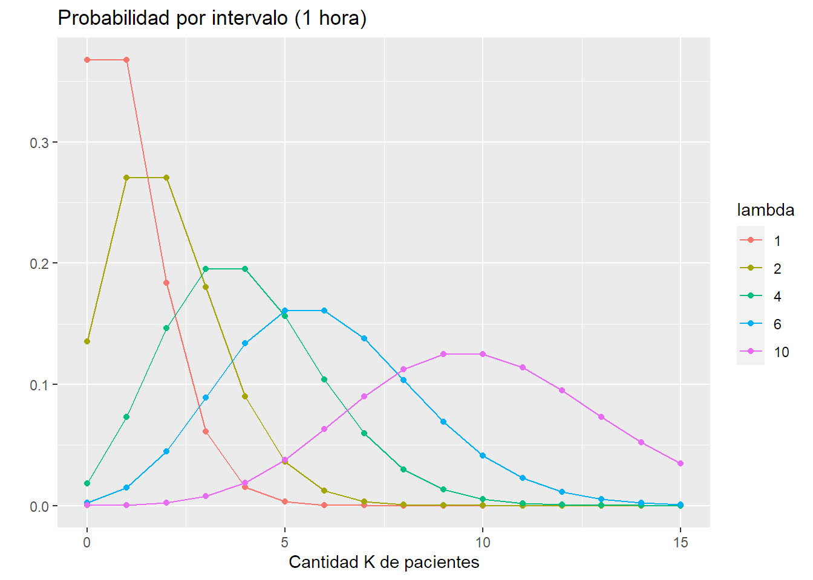
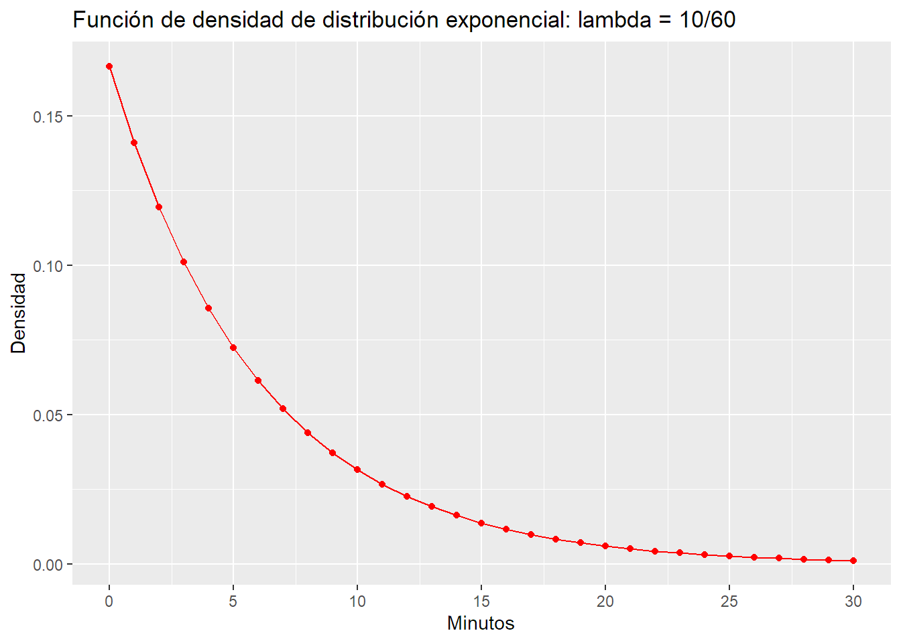
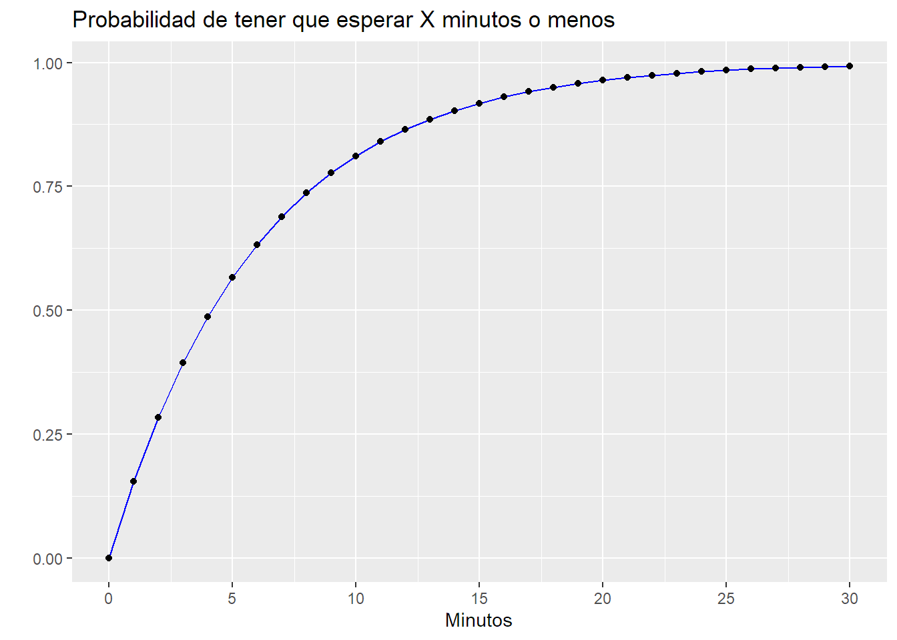
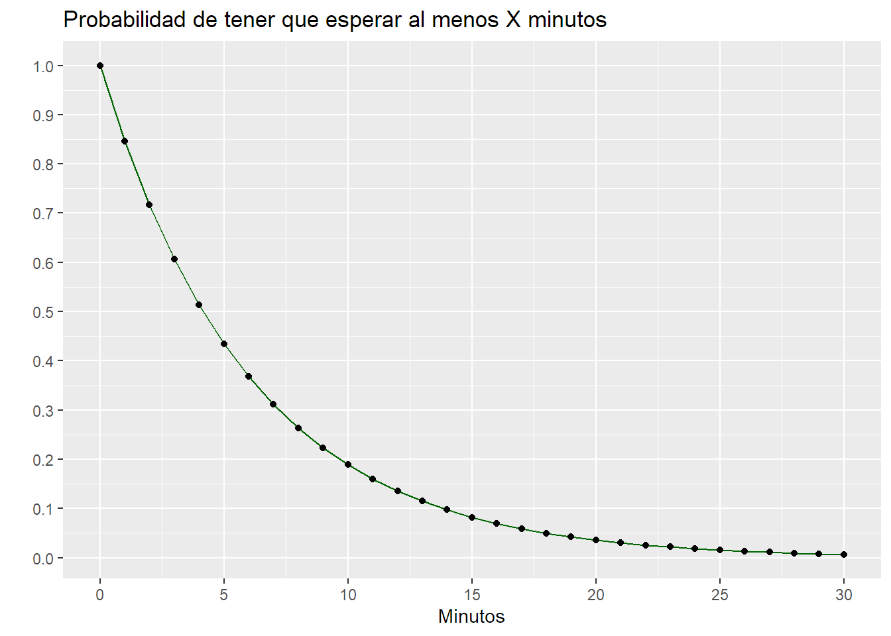

# Proceso Poisson y distribucion exponencial

Basado en:  
https://stats.stackexchange.com/questions/2092/relationship-between-poisson-and-exponential-distribution  
https://towardsdatascience.com/the-poisson-distribution-and-poisson-process-explained-4e2cb17d459

Un proceso que sigue un *proceso de Poisson* es aquel que tiene un cantidad de eventos promedio cada determinada unidad de medida (generalmente tiempo). Estos sucesos deben ser independientes y aleatorios pero la cantidad debe estar centrada alrededor del promedio ya mencionado. Una última condición es que dos sucesos no pueden suceder en simultáneo.

Para ejemplificar, podemos suponer que la cantidad de pacientes que llegan a la guardia de un hospital sigue un proceso de Poisson. 


Un proceso Poisson se puede "descomponer" en 2 conceptos.  

* Una disitribución **Poisson (no proceso!)** que provee la función de densidad de la cantidad de pacientes que ingresan al hospital. (Discreta)
* Una distribución **exponencial** que modela el tiempo que transcurre entre cada paciente. (Continua)

### Distribución Poisson

Esta distribución sirve para modelar la cantidad de pacientes. Digamos que ingresan en promedio $\lambda$ pacientes por *hora*.

La función de probabilidad (probability mass function en inglés ya que es discreta) es: 
$$P(K) = e^{-\lambda}\frac{\lambda^k}{k!}$$

Donde K es la cantidad de pacientes en una hora y $\lambda$ es como dijimos,  la cantidad promedio que ingresa por hora.
La función nos dice qué probabilidad hay de recibir K pacientes en una hora si en general llegan $\lambda$.

Distintos $\lambda$ devuelven obviamente distintas probabilidades para cada valor de K. Vemos que a medida que crece $\lambda$ la densidad se parece cada vez más a una normal.


```r
lambda = c(1,2,4,6,10)
k = seq(0,max(lambda)*1.5)
df <- expand.grid(lambda = as.factor(lambda), k = k) %>%
  mutate(poisson = dpois(k, as.numeric(as.character(lambda))))

ggplot(data = df, aes(x = k, y =poisson, colour = lambda)) + 
  geom_line() + 
  geom_point() + 
  ggtitle("Probabilidad por intervalo (1 hora)") +
  xlab("Cantidad K de pacientes") + 
  ylab("")
```



$\lambda$ determina la forma de la dsitribución y como es de esperar, esta se centra alrededor del parámetro ya que es la cantidad promedio en el intervalo. Una propiedad interesante es que la varianza de la disitribución también es $\lambda$.  
Los pacientes que llegan al hospital siguen una distribución $\sim  P(\lambda)$.

Otra caracterísica es que uno puede escalar la distribución para cualquier intervalo. Es decir que si nuestro modelo era para cantidad de pacientes por hora, uno puede multiplicar $\lambda$ por 3 si quiere la distribución cada 3 horas, o dividir por 6 si la quiere cada 10 minutos por ejemplo. Esto es asi porque en realidad en la función de probabilidad de la distribución Poisson, $\lambda$ está multiplicado por el intervalo *t*,pero se simplifica y se lo asume 1. Luego uno puede derivar para el lapso que desee multiplicando.


### Distribución Exponencial

Sabemos que llegan $\lambda$ pacientes por hora. Nos gustaría ahora saber la distribución para el tiempo de espera hasta que llegue el próximo paciente. Es decir, parados en el momento *t*, qué probabilidad hay de tener que esperar un minuto, 2, 10 hasta el próximo paciente?

El concepto es el siguiente. Si queremos saber la probabilidad de que haya que esperar al menos X minutos, es lo mismo que calcular la probabilidad de que la cantidad de pacientes en el momento t+x sea igual a la cantidad de momento t. Es decir, que no haya llegado nadie.  
$N_{t+x} = N_{t}$.  

Podemos calcular eso con la distribución Poisson. Es simplemente la probabilidad de 0 pacientes en un intervalo x.

$$P(N_{t+x} - N_t = 0) = e^{-\lambda x}\frac{\lambda x^0}{0!} = e^{-\lambda x} $$
La probabilidad de obtener un nuevo paciente en el intervalo x es 1 menos la probabilidad de no obtener ninguno,  por lo tanto:
$$ P(X_t \leq x) = 1 -  P(N_{t+x} - N_t = 0) = 1 - e^{-\lambda x}$$
Este último resultado es la **función de probabilidad acumulada de la exponencial**. La probabilidad de tener que esperar X o menos minutos depende de $\lambda$ y x.

Con la derivada obtenemos la **Función de distribución de la exponencial**.
$$f(x, \lambda) = \lambda e^{-\lambda x}$$

Si al hospital llegaran 10 personas por hora a la guardia, tendríamos la siguiente función de densidad de la exponencial.
Tener en cuenta que $\lambda$ = 10 en la poisson (10 casos por unidad de tiempo (hora)), sin embargo, en la exponencial queremos medirlo en minutos, por lo que usamos un $\lambda$ de 10/60.


```r
lambda = c(10)
t = seq(0,30, by = 1)
df2 <- expand.grid(lambda = as.factor(lambda), t = t) %>%
  mutate(exponencial = dexp(t, as.numeric(as.character(lambda))/60))

ggplot(data = df2, aes(x = t, y =exponencial)) + 
  geom_line(colour = "red") + 
  geom_point(colour = "red") + 
  ggtitle("Función de densidad de distribución exponencial: lambda = 10/60") +
  xlab("Minutos") +
  ylab("Densidad") +
  scale_x_continuous(breaks = seq(0,30, by = 5))
```



Por otro lado podemos ver la probabilidad acumulada hasta determinado minuto. Siguiendo el mismo ejemplo de 10 pacientes por hora (Poisson con $\lambda = 10$), la acumulada de la distribución exponencial tiene la siguiente forma.

*Hay alrededor de 80% de chances que un paciente llegue en los próximos 10 minutos.*

```r
lambda = c(10)
t = seq(0,max(lambda)*3, by = 1)
df2 <- expand.grid(lambda = as.factor(lambda), t = t) %>%
  mutate(exponencial = pexp(t, as.numeric(as.character(lambda))/60))

ggplot(data = df2, aes(x = t, y =exponencial)) + 
  geom_line(colour = "blue") + 
  geom_point() + 
  ggtitle("Probabilidad de tener que esperar X minutos o menos") +
  xlab("Minutos") + 
  ylab("") +
  scale_x_continuous(breaks = seq(0,30, by = 5))
```



Por último, si lo quieren ver al revés. Podemos ver la probabilidad de tener que esperar al menos X minutos para que llegue el próximo.

*Hay alrededor de 5% de chances de tener que esperar 20 minutos hasta el próximo paciente*

```r
lambda = c(10)
t = seq(0,max(lambda)*3, by = 1)
df2 <- expand.grid(lambda = as.factor(lambda), t = t) %>%
  mutate(exponencial = pexp(t, as.numeric(as.character(lambda))/60, lower.tail = FALSE))

ggplot(data = df2, aes(x = t, y =exponencial)) + 
  geom_line(colour = "darkgreen") + 
  geom_point() + 
  ggtitle("Probabilidad de tener que esperar al menos X minutos") +
  xlab("Minutos") + 
  ylab("") +
  scale_x_continuous(breaks = seq(0,30, by = 5)) + 
  scale_y_continuous(breaks = seq(0,1, by = 0.1))
```


