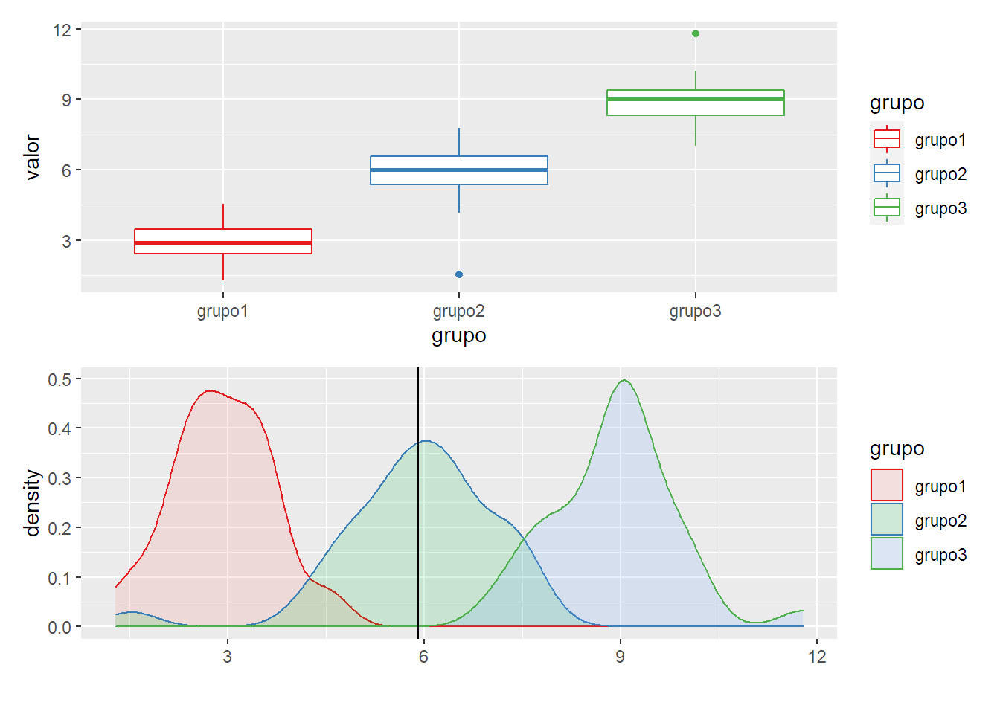
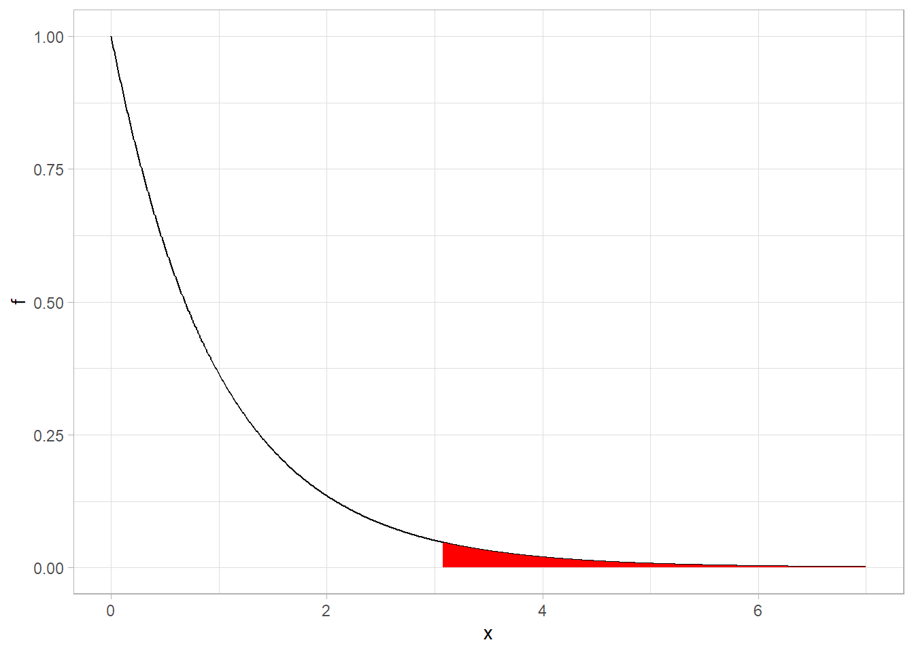
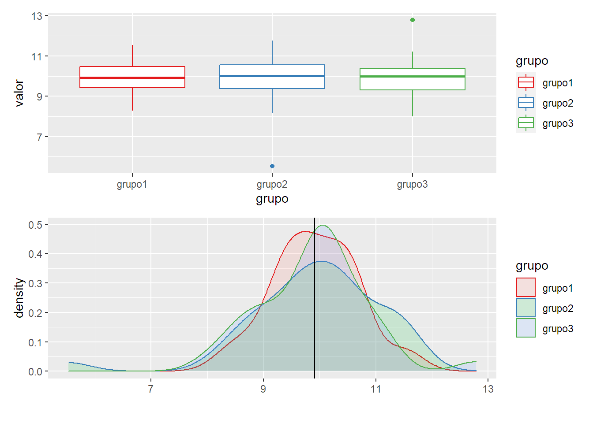

# ANOVA

```r
library(tidyverse)
library(patchwork)
```

ANOVA refiere a "Analysis of Variance" en inglés y corresponde a una serie de procedimientos estadísiticos que permiten estudiar diferencias de medias poblacionales, basado en muestras.   
Es una técnica muy difundida para comparar medias de 2 o más grupos. Específicamente queremos ver
si todos los grupos comparten media o al menos uno difiere. En el caso más simple, de comparar dos medias, el resultado es equivalente al *test t de comparación de medias*  por lo que ANOVA se considera una generalización de este.

El test de hipótesis sería:
$$H_0: \mu_1 = ... = \mu_k$$
$$H_1: \text{las medias no son iguales}$$
ANOVA tiene también una serie de supuestos que hay que tener en cuenta.  

* Independencia de las observaciones.
* Normalidad en los residuos. Podemos pensarlo como normalidad dentro de cada grupo, siendo el residuo la parte no explicada por la media del grupo. En muestras chicas puede ser problemático si no se cumple (reduce la potencia del test). Con muestras grandes debería cumplirse por Teorema Central del Límite.
* Homocedasticidad. Se supone que cada grupo tiene misma varianza. Si la muestra no es muy chica ANOVA es bastante robusto con este supuesto, si no, hay alternativas no parámetricas por ejemplo.

### Un ejemplo simulado

Generamos primero un set de datos donde la media de 3 grupos es distinta y vamos paso a paso con los cálculos.

```r
set.seed(24)
df = data.frame(grupo1 = rnorm(n = 35, mean = 3, sd = 1),
                grupo2 = rnorm(n = 35, mean = 6, sd = 1),
                grupo3 = rnorm(n = 35, mean = 9, sd = 1))
```

Tenemos 3 grupos de 35 observaciones, cada uno proveniente de poblaciones con medias notoriamente distintas.  
Veamos como resultaron las medias muestrales.


```r
sapply(df, FUN = mean)
```

```
##   grupo1   grupo2   grupo3 
## 2.916989 5.910171 8.904245
```

Viédolo gráficamente vemos que son muy dispares y ANOVA debería captar estas diferencias.  
En el segundo gráfico, la linea vertical represnta la media general del dataset



Veamos como resulta analizar esto con ANOVA.  

### Cálculos.

Obviamente existen paquetes estadísticos para realizar este análisis rapidamente pero iremos paso por paso.  
La lógica es comparar la media de las poblaciones y para ello nos basamos en la varianza. Más precisamente en la descomposición de la varianza.

$$SC_{Total} = SC_{Entre} +  SC_{Dentro}$$
La suma de errores cuadrados de TODO el dataset se puede descomponer entre el desvío cuadrado de cada grupo frente a la media general (Entre) más el desvío cuadrado de cada observación respecto a su media grupal.

Siendo más intuitivos. Los suma de los desvíos cuadrados de cada observación respecto a la media general 5.91 pueden ser vistos como la diferencia entre medias grupales (qué tan lejos está cada pico del gráfico de la media grupal) más qué tan dispersos están los datos dentro de cada grupo.  

Cuanto más grande sea la brecha entre la variabilidad entre grupos y la variabilidad al interior de los grupos, más probable es que las medias poblacionales sean distintas. Es decir, si la variabilidad total se explica más por la diferencia entre medias grupales que por la diferencia entre desviós al interior, entonces más evidencia en favor de distintas medias grupales. Si el ratio no es tan grande, entonces tenemos menos fuerza para afirmar tal cosa.

Para poder comparar correctamente, no se mira directamente $SC_{Entre}$ vs $SC_{Dentro}$ ya que estos dependen del tamaño de la muestra, sino que se los normaliza primero.  $SC_{Entre}$ se normaliza por sus grados de libertad siendo *k-1* (cantidad de grupos menos 1) y  $SC_{Dentro}$ se normaliza con *N-K* (observaciones totales menos cantidad de grupos).

>#### Detalle técnico
Como asumimos que los residuos son normales, entonces elevarlos al cuadrado nos devuelve una distribución *Chi-Cuadrado*. Las sumas de residuos al cuadrado son entones Chi-Cuadrado con los grados de libertad que mencionamos.
Si dividimos dos distribuciones Chi-Cuadrado, normalizadas por sus grados de libertad, obtenemos una distribución F con grados de libertad equivalentes a los de ambas Chi-Cuadrado.

Ese estadístico F, que sigue la distribución recién mencionada sera nuestro estádistico para testear la Hipótesis.

$$F = \frac{\frac{SC_{Entre}}{K-1}}{\frac{SC_{Dentro}}{N-K}}$$

Donde:
$$SC_{Entre} = \sum_{i=1}^k{n_i (\bar{x}_i} - \bar{x})^2$$
$$SC_{Dentro} = \sum_{i=1}^K\sum_{j=1}^{n_k}{(x_j - \bar{x}_i)^2}$$
Luego como en cualquier test de hipótesis, comparamos el estadístico F con la distribución teórica si la hipótesis nula fuera cierto y según el valor de alfa que hayamos elegido, rechazamos o no la hipótesis nula.  
Para ilustrar, la dsitribución F tiene la siguiente forma con los grados de libertad de nuestro ejemplo.



Donde la región en rojo es el area de la curva posterior al 95% de la distribución. Si nuestro estadístico cae en la zona rojo podemos rechazar la hipótesis nula con alfa =0.05

Obtengamos los números con la función aov.

```r
res = aov(valor ~ grupo, data = df_long)
summary(res)
```

```
##              Df Sum Sq Mean Sq F value Pr(>F)    
## grupo         2  627.3  313.66     326 <2e-16 ***
## Residuals   102   98.1    0.96                   
## ---
## Signif. codes:  0 '***' 0.001 '**' 0.01 '*' 0.05 '.' 0.1 ' ' 1
```

La tabla que devuelve la función es justamente todo lo que fuimos viendo.  
Sum Sq es la suma de desvíos cuadrados. La fila de grupo corresponde a *Entre* y Residuals corresponde a *Dentro*.  
DF son los grados de libertad (K-1) y (N-K).  
Mean Sq es la división de Sum Sq por sus grados de libertad. Serían el numerador y denominador del estadístico F.  
F value es simplemente la división de los Mean Sq. Obtenemos un estadístico de 326(!). A partir de 3 aprox ya podíamos rechazar la hipótesis nula. El p-value (la última columna) es virtualmente 0.

Dado este resultado, podemos rechazar la hipótesis nula y asegurar con el 95% de confianza que las medias poblacionales no son iguales.  
Era un caso medio extremo pero sirve de ejemplo.

Lo que no nos dice ANOVA es si todas son distintas o cuál es diferente al resto. Para ello hay que hacer estudios posteriores pero no entramos en detalles acá.

### Un caso de medias iguales





```r
res2 = aov(valor ~ grupo, data = df2_long)

summary(res2)
```

```
##              Df Sum Sq Mean Sq F value Pr(>F)
## grupo         2   0.00  0.0014   0.001  0.999
## Residuals   102  98.14  0.9621
```

Aquí es el otro extremo. El valor del estadístico F es casi 0, por lo tanto el p-value es casi 1. No hay evidencia para rechazar la hipótesis nula.

### Conclusiones

ANOVA cómo método para comparar medias poblacionales es muy sencillo de aplicar y bastante robusto frente a inconsistencias en los supuestos. Permite dar una medida objetiva de si es posible o no rechazar la hipótesis nula, más allá de que uno pueda tener una primera impresión visual.

Para ir un paso más allá, ANOVA se puede relacionar directamnte con las regresiones lineales. Anova tal como lo presentamos es equivalente a correr una regresión donde la variable independiente es el grupo al que pertenece la observación. Las generalizaciones como ANCOVA, MANOVA, etc, también tienen su correlato en regresión. Esto sucede porque según el campo de estudio se eligieron caminos y convenciones distintos de análisis, llevando a distintas ramas que al final hacen lo mismo, pero genera confusión al intentar entender la estadística como un todo.
