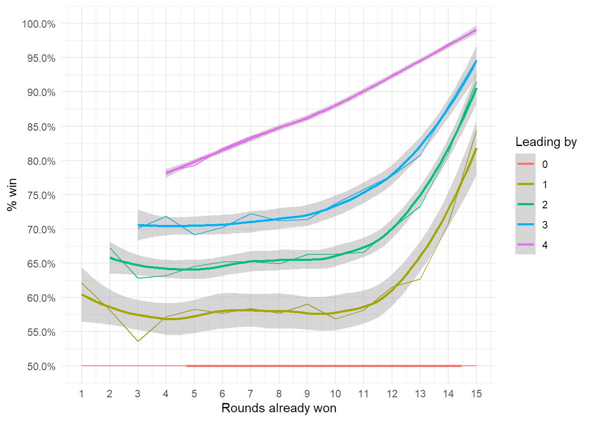
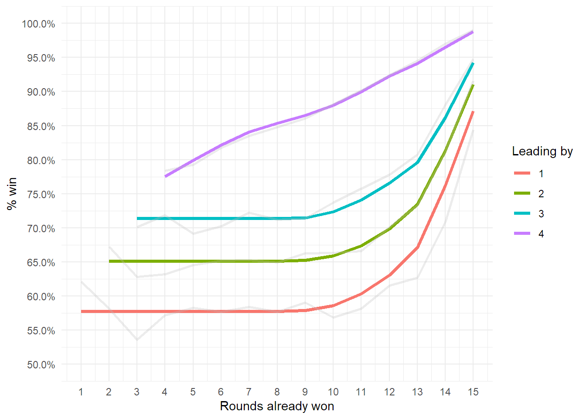

# Counter Strike: chance of winning

This [CS GO Kaggle link](https://www.kaggle.com/skihikingkevin/csgo-matchmaking-damage) has data about several competitive CS GO matches.
In a few words:  

* those are 5 vs 5 matches where each team tries to kill the other or complete a task (planting or defusing the bomb depending the role you are playing) before the time expires.  
* The goal is to win 16 rounds before the other team.  
* After 15 rounds both teams switch sides/role.

The data has mostly information about each time a player damages another one (and eventually kills it), some grenades usage and some general data of each round as the amount of money spent by each team and the result of that round.  

In here I have followed [Namita Nandakumar hockey example](https://www.youtube.com/watch?v=_UVN1fwkjaU&ab_channel=LanderAnalytics) to obtain and model some basic winning probability based on the lead and how many rounds have been played so far.  

This is how probability of winning looks as the game progresses, grouped by how much the current winner is leading. (Averaging leads greater than 4 to keep it clean ).  
The thin line is the *empirical probability*, based solely on segmenting the data.  
The thick line is a local regression with its standard deviation.

  
So, as we see there is some noise around the trend and the approximation wiggles a bit as you go through X. We would like to have a model where winning by some amount is always better if you are closer to 16. Let's say it is not crazy to assume that if you are winning by 3, 15 to 12, you should always have higher chances to win than if you are leading 6-3.  

Namita shows that xgboost is a nice tool to impose that kind of constraint to a simple model using the monotone constraint parameter.


```r
params = list(objective = "binary:logistic",
              eval_metric = "logloss",
              max_depth = 2,
              eta = 0.1,
              monotone_constraints = c(1,1)) 
```

What we get is a model that follows the constraints, although has some bias for the lower leading categories. Nevertheless is a quick approach to approximate the probabilities in a credible way.  
You could use the dataset to explore other stuff since it has some rich information about locations.



