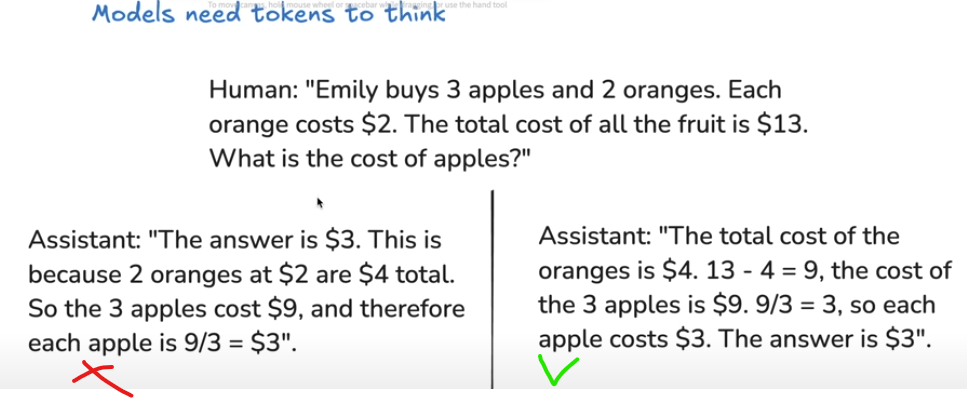

---
authors:
- fbetteo
categories:
- AI
- Machine Learning 
comments: true
date: 2025-03-10
description: Notes on Deep Dive into LLMs Like ChatGPT - Karpathy
draft: false
slug: deep-dive-into-llms
tags:
- Machine Learning
---

# Deep Dive into LLMs Like ChatGPT - Karpathy

[Original video from Andrej Karpathy. Masterpiece.](https://www.youtube.com/watch?v=7xTGNNLPyMI)

---

[Fineweb](https://huggingface.co/spaces/HuggingFaceFW/blogpost-fineweb-v1)

Tokenization. From words to tokens. Tokens are not words and punctuation, they can be the root of words, they can be some sequence of letters without explicit meaning. This will change depending on the model. ([tiktokenizer](https://tiktokenizer.vercel.app) para verlo en accion)

How it works? From words to bits with encoding could be the first step. From words to 1 and 0. But this becomes a super large representation because we only have two symbols.
We can group every 8 bits into 256 different bytes. [0 to 255]  The sequence is much shorter because we have more symbols.
We can use this, but in SOTA we go beyond that. We use Byte-pair encoding which looks for common pairs of bytes and we create a new symbols starting from 256, and we can do this many times. More symbols, shorter representation. Gpt4 ends up with +100k symbols.

### Neural Networks

We take windows of tokens of flexible  length up to some maximum (4, 8, 16k). Too much could be computationally expensive.

The idea is to predict the next token. The window used is the *context*.
We do this for every context and token of the training data. The process will adjust the probabilities of each next token. They are initialized at random and in the end they should match the statistical properties of the dataset.

Training is done via Neural Network, the mathematical expression is updated via weights. Input is the token sequence, output is the probability of each token as the next one. In the middle there is the NN architecture with transformers and etc. First parts includes the embedding into numerical representation.

#### Inference

Put an initial token and sample from the output probability distribution, this is your next token. We do that again, but now the context is 2 tokens, and so on.

### GPT-2 train and inference

Useful because the technical parts are still relevant only that now are bigger and more complex.

Base model is the model that comes out after training. It's an inference machine, just token prediction but it's not useful for chat for example. Some companies release their base models but not all of them.
GPT2 was released. A base model release requires, the model architecture and the model weights.

Llama 3 is another one more recent. 2024, 405 billions parameters

Base model are somewhat good at memorization (regurgitation) which is not desirable. If you paste the first sentence of a wikipedia page it will probably output the exact rest of the article up until some point and then deviate.

Wikipedia also has more weight in the model because the source is truthful. I'm not sure if this is because the wikipedia extract appears more times in the corpus because of citations and so or because some sources have more importance than other from pretraining methodology. 

Base model is still useful to some extent without being an assistant if you are clever with the prompt.

**Few shot prompt**. 
The model has some *in-context* learning, which is that the model can understand a pattern in the prompt. In the video, AK prompts a list of english words with their korean translation and left the last one without translating to make inference from that point.

He also shows that you can generate some assistant type of inference via in-context learning by passing an example of human-assistant interaction and making it generate the answer to you actual question via inference.

### Post training

Pretraining is all that we saw before. Get data from the web, tokenize it and create a base model that predicts next token. It's not an assistant, it's like a internet text generator. That's all included in pretraining and it's the expensive part, the one that takes millions of dollars and a lot of time.

**Post training**  
Much less computation than pretraining and it's the step that moves us from a token generator to an assistant.

Because this is a neural network we can't explicitly program the assistant or give them a personality or make it refuse some kind of questions. We can only do that via neural networks training on datasets.

Programming by example.
And the examples requires human labelers.
We train the model on this responses and try to imitate that behaviour.

We substitute the training dataset of the model, we remove all the internet text and we start using the conversation dataset. We keep training the model but know with this dataset and the model will pick the statistics of this new dataset and how the conversations should happen. (Supervised Finetuning aka SFT)

Post training in SOTA can be in 3 hours for example vs 3 months of training in pre training and thousands of CPUs. This is because post training the dataset is human created and much smaller.

#### How do we go from conversations in the new dataset to tokens?

We need to encode and decode in some specific way. Each model has a slightly different methodology, but gpt-4o has for example a few extra tokens that represent the beginning of the new character talking (user or assistant), then a token for the user or the assistant, then a token for the start of the actual message, then the message tokenized  and then a token for the end of the message. Then we go again, same token representing the beginning, then the other token of user/assistant, etc

So, when we go to chatgpt and ask a question it's sent to the backend encoded with the above format and they add the tokens for the start of a new message from the assistant and run inference there, they let the LLM complete all the next tokens.

[InstructGPT paper on SFT:](https://arxiv.org/abs/2203.02155)First paper to talk about post-training.
Mentions the heavy human labeler part from where the post training datasets with conversations emerged and some of the instructions the labelers received.
The dataset from OpenAI is not released, but OpenAssistant is an open source alternative with a similar format.

Currently LLMs are being used to help create this datasets of conversations. No need for that much human effort.
But in the end the root of all this conversations is the initial human labelers following OpenAI and other companies instructions.
In the end, chatgpt for example, is answering in the tone and guided by those examples, so it's kind of recreating how the labelers wrote. It's a labeler text generation machine. 
> "What would a human labeler say in this conversation?"
 You are talking to a simulation of an average labeler (who is probably some skilled person but still)

### Hallucinations

They exist because the model is sampling from the training dataset statistics trying to answer something even if it's not the truth. The problem has been improved over the years but it's still relevant.

How to fix it?

We need to include in the post training dataset some conversations where the answer is that it doesn't know.

#### Mitigation #1: model interrogation
What Meta did for LLama is super clever
. We don't know what the model knows or not exactly so we need to let it decide in some way. They assume there is some internal representation of lack of knowledge, some neuron that gets activated when it doesn't "know" something.
So, what they did to include that pattern is to take random text (from wikipedia lets say) and they used an LLM to create a few questions with factual answers about that text.
They interrogate the model with those questions and compare the answer to the actual truth (also another LLM as judge, no need for human). They did it a few times per question. If the model answered correctly then the conversation output is fine and all good. But if the model hallucinates and answers wrongly (as judged by another LLM based on the actual truth) then the answer to that question in the conversation dataset becomes "Sorry, I don't know". If you add some amount of answers like this (because of course you can't just add all question that don't have a true answer) then the model will get that pattern, that when that unknown neuron related to lack of knowledge gets activated, then answering I don't know is what it should do.
This worked quite well to mitigate hallucinations!

#### Mitigation #2: Search
Allow the model to search the internet. Allow the model to use Tools.
We do this by introducing new tokens, in this case special tokens for search_start and search_end with a query in the middle. The Assistant will look up that query in a browser and will copy paste the information it gets just after the special tokens, so the internet information is now in the context. It goes directly into the model, like refreshing our memory as humans.

To add this functionality we need again to teach the model by example, adding a bunch of examples in the dataset on how to use the search.

> Knowledge in the parameters == Vague recollection (e.g. of something you read 1 month ago)
> Knowledge in the tokens of the context window == Working memory

## Models need tokens to think
Given the neural network architecture, there is a finite amount of computation that can be given for each token. Given the context your forward/inference pass will predict the next token using the network capability but it's finite/limited. We should try to expand/distribute the computation, "the thinking" between many tokens to use the full neural network computation power for each token, so we end up using more computation in total for our answer.
In concrete, he shows a simple math problem. If we aim for the model to answer directly, we are forcing the neural network to use it's context and finite computation to answer in a single attempt. Everything that comes after that answer will be a post hoc justification. While if we aim for the model to elaborate and go step by step (disguised CoT?) it will use full computation for each step and by the time it outputs the answer, it will have a good detailed context to provide that final "calculation"

This is the same reason why models are not good at counting. Too much expected from a single forward pass, finite computation.

"use code" it's a great way to make the model good at those tasks, because the model is good at copy pasting and code gives the right answer. So, you can just copy the string to code and then use python to actually count the number of letters or whatever. Same for calculation.
It's much more likely to have the right answer than relying on the "mental arithmetic" of the model.

It's also interesting to understand why a model might be good at solving complex phD level math problems but fail at simple tasks like:
"what is bigger 9.11 or 9.9?" 
which usually is answered wrongly or randomly.

One hypothesis he mentions is that some research team said that the bible has 9.11 > 9.9 in terms of verses and this can create confusion to the neural network but it's a problem not fully understood.

## Reinforcement Learning

The last major stage, some times is included  as part of post training but it's really a next separate major step.

>It's like going to school.

He compares the training of  a model to a textbook, general explanations are like the pretraining, then the examples given in the book is like the post training with examples of how things should be solved (how to answer like an assistant) and then there are exercises which the student doesn't have the solution and needs to try to solve. You might have the final answer but not the path towards it. Reinforcement learning is like this last step.

The motivation is that we as humans (labelers) don't know what's the best way for the LLM to solve a specific problem, such as a math problem. He shows a few options, like going straight to the answer, doing some arithmetic, talking in native english and giving the answer, putting the problem as a system of equations, etc. What's easier for us might not be easy for the LLM, so we need to try what approach gives best results.

So, the idea is to generate multiple (thousands) solutions for some problem which isn't trivial and store the stochastic solutions / inferences / token sequence that led to a right answer among all the tries. Some will get the right answer, some don't. And then, the model will be retrained based on the right solutions. So, it's not human labeled anymore, it's just trying solutions and re-train on the ones that were correct so the network learns to keep doing that for similar situations in the future.

Pre and post training are quite standard and used across all providers but the reinforcement learning step is in an earlier stage and not standardized, different providers are trying different approaches and how some details in the process are handled (which is a simple idea overall) has high impact and is not trivial, those details in how we select what is "the best answer" among the correct ones for example play a big role.

### Deepseek R1

The [paper](https://arxiv.org/abs/2501.12948) was innovative and game changer in part because is  open and explicit about RL while openAI and other kept the details for themselves.

With RL, the model learns over time to give better answers to the questions and it's using more and more tokens to do it. It "discovers" that trying many paths and backtracking and trying again it's better to get a good answers. *Chain of thoughts* emerge without being hardcoded anywhere by researchers (would be impossible too, it's something the model needs to discover)

> A "thinking/reasoning" model is one that has been trained with Reinforcement Learning

ChatGPT 4o is not a reasoning one, is SFT montly (learn by example, just finetuned, no RL. He says there is a bit of RL but we should think about them as SFT really). DeepSeek uses RL.  o1 and o3 are also RL ones.

### AlphaGo

RL made it possible for the model to beat top players ELO while supervised learning was not capable. RL is not restricted to human kind of plays and that's how move 37 happened, a play that was not expected by top level players but that actually was really powerful. This happened because the training wasn't guided by supervised learning but by RL (the AI playing against itself kind of)

### Learning in Unverifiable domains (Reinforcement learning from Humand Feedback)

The previous problems where easily verifiable, we could just compare in RL if the solution was correct by checking the final output of the LLM vs the right answer, maybe by direct comparison or using LLM as judge where we ask another LLM to check if the solution provided by the model is consistent with the actual solution (currently that approach is quite reliable) but this can't be done in *unverifiable domains* such as "write a joke about pelicans", "write a poem", etc

For the pelican jokes, in principle you could use humans to judge if the joke is funny and reward it but as you need to evaluate thousands of generations for thousands of prompts, this becomes unfeasible. We need another strategy. This [paper](https://arxiv.org/abs/1909.08593)introduced the RL-HF subject

**RLHF approach**
**STEP 1** :Take 1000 prompts, generate 5 options, order them from best to worst.
**STEP 2**: Train a neural net simulator of human preferences ("reward model")
**STEP 3**: Run RL as usual, but using the simulator instead of actual humans

The reward model is not a perfect human simulator but it's currently good enough to work meaningfully. 

#### Upside
> We can run RL in arbitrary domains (even unverifiable ones) and empirically it gives better results.

He says that probably this improves the model due to **discriminator - generator gap**. It's easier for a human to discriminate than to generate. It's easier to say which jokes are good or bad than to create the good ones. The labeler doesn't need to create a good joke, it just leaves that hard task to the model and the labeler points out which are good and which are bad

#### Downsides
RL is done with respect to a *lossy simulation* of humans. It might be misleading, we generate orders based on a model that might not reflect the actual human judgement.

> RL discovers ways to "game" the reward model.

It happens that after a lot of updates, the jokes that are considered the top are non sensical. At first, we some initial updates the jokes might improve but after some point in time they become much worse, like a top joke could be "the the the the the" and somehow that gets a high score by the reward model. Those weird top answers are *adversarial examples*. Somehow the RL get some answers that go through little paths that somehow  fire good scores without making human sense. The reward model are massive neural nets and they have cracks.

You could get this non sensical answers and add them to your dataset with very low ranking to make it learn that this is not a good joke but this is an infinite process, there will always be more adversarial examples to be found by the neural net.

What to do?
Just train the RL for some time and crop the training, don't go too far so you avoid the adversarial example generation.

**This is true for RLHF, not RL** .
Plain RL can be run indefinitely because you can't really game the answer, you are looking for a specific answer and the neural net will find ways, even non standard ways, to find that answer but it's totally verifiable. RLHF is different, and a reward function can be gamed, so RLHF can't be run forever while plain RL yes.